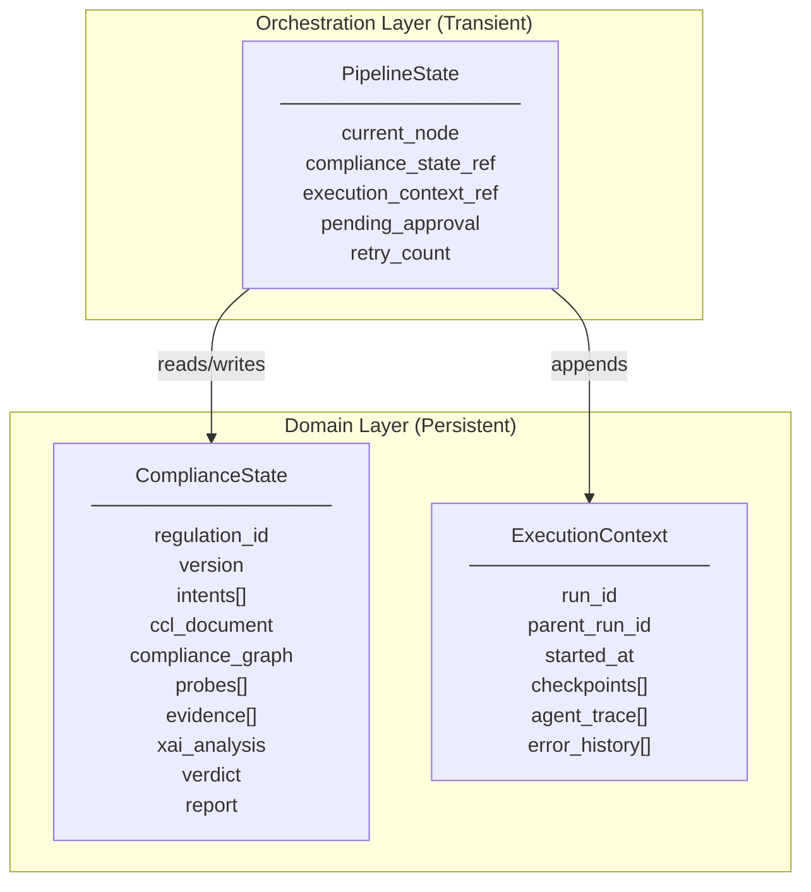
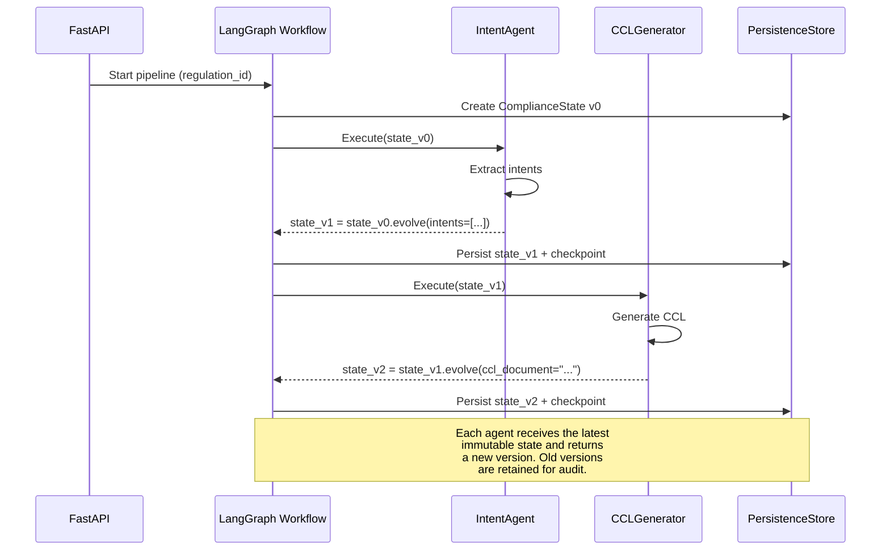
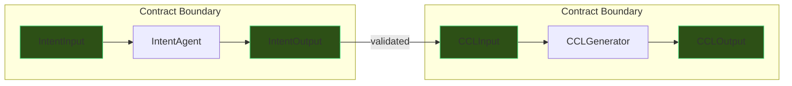
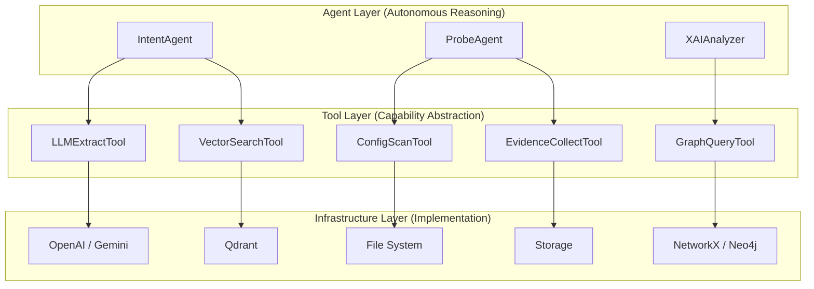
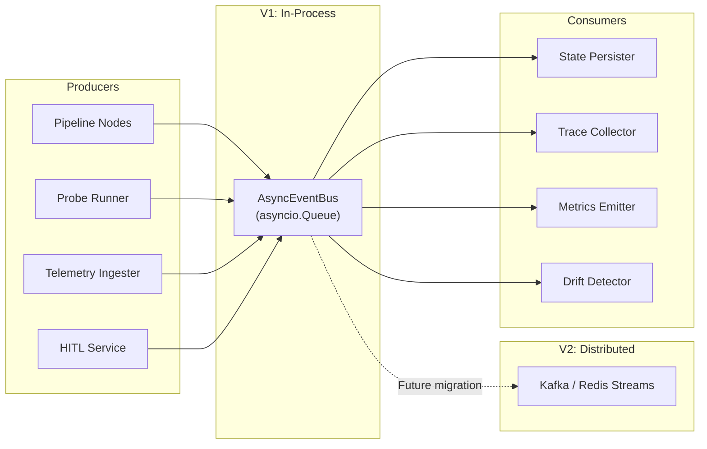
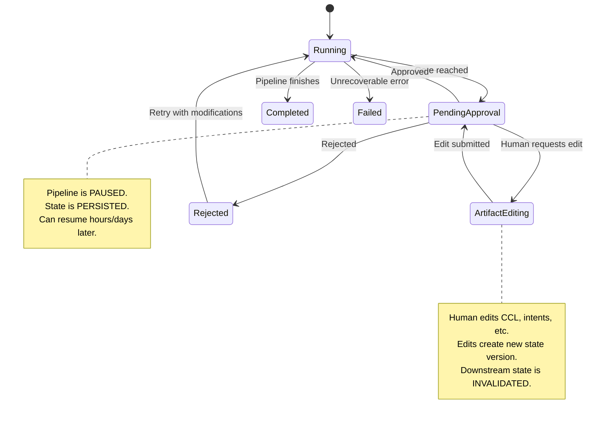
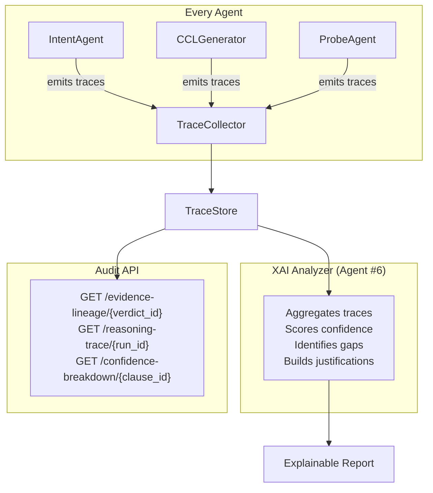
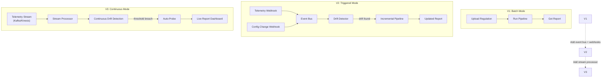

# CompliAI — Architecture Hardening & Refinement

> Surgical architectural upgrades to evolve the existing scaffold into a production-grade autonomous compliance platform.

---

## 1. Architectural Critique of the Current Scaffold

The existing scaffold is **clean, modular, and well-structured** — a solid foundation. However, it has several structural weaknesses that will become critical as the system scales beyond V1:

### What's Strong

| Area | Assessment |
|------|------------|
| Folder structure | Clean separation of concerns |
| API layer | Proper versioning, service/repo pattern |
| Agent modularity | Each agent in its own package |
| Infrastructure abstractions | Good LLM/vector store interfaces |
| Docker setup | Reasonable multi-stage builds |

### What's Weak

| Problem | Impact | Severity |
|---------|--------|----------|
| **Pipeline-centric, not state-centric** | State is a transient `TypedDict` inside LangGraph — no domain ownership, no persistence, no lineage | 🔴 Critical |
| **No agent contracts** | Agents have `execute()` but no typed I/O boundaries — one agent's output format change silently breaks downstream agents | 🔴 Critical |
| **Agents directly touch infrastructure** | LLM calls, graph writes, vector queries are inside agent code — impossible to test, swap, or reason about autonomously | 🟡 High |
| **No event system** | The pipeline is synchronous request→response — cannot evolve to continuous compliance without a complete rewrite | 🟡 High |
| **HITL is a checkpoint, not a workflow** | The `checkpoints.py` is a hook, not a full approval/edit/resume lifecycle | 🟡 High |
| **Explainability is an agent, not an architecture** | XAI is one of the 7 agents — but explainability must be a *cross-cutting concern*, not a pipeline stage | 🔴 Critical |
| **No persistence model** | Pipeline state exists only in memory during execution — no resumability, no audit history, no recomputation | 🟡 High |
| **No realtime evolution path** | Architecture assumes batch regulation-upload → report — no path to continuous telemetry-driven compliance | 🟠 Medium |

### The Core Insight

The current architecture treats compliance as **a pipeline that runs once**. The hardened architecture must treat compliance as **a living state that continuously evolves** — a true digital twin.

---

## 2. Structural Additions — Delta from Current Scaffold

The following new packages are added. **No existing packages are removed or rewritten.**

```
compliai/
├── ...existing structure...
│
├── domain/                         # ← NEW: Canonical domain model
│   ├── __init__.py
│   ├── compliance_state.py         # Immutable compliance state
│   ├── execution_context.py        # Execution lineage & metadata
│   ├── regulation_lineage.py       # Regulation versioning
│   └── state_machine.py            # State transition definitions
│
├── contracts/                      # ← NEW: Agent I/O contracts
│   ├── __init__.py
│   ├── base.py                     # AgentInput, AgentOutput, FailureContract
│   ├── intent_contract.py
│   ├── ccl_contract.py
│   ├── mind_mapper_contract.py
│   ├── skill_generator_contract.py
│   ├── probe_contract.py
│   ├── xai_contract.py
│   └── document_builder_contract.py
│
├── tools/                          # ← NEW: Tooling abstraction layer
│   ├── __init__.py
│   ├── base.py                     # AbstractTool, ToolResult, ToolContext
│   ├── registry.py                 # ToolRegistry
│   ├── llm_tools/
│   │   ├── __init__.py
│   │   ├── extract.py              # LLM extraction tool
│   │   ├── generate.py             # LLM generation tool
│   │   └── classify.py             # LLM classification tool
│   ├── graph_tools/
│   │   ├── __init__.py
│   │   ├── query.py                # Graph query tool
│   │   └── mutate.py               # Graph mutation tool
│   ├── probe_tools/
│   │   ├── __init__.py
│   │   ├── config_scan.py          # Config scanning tool
│   │   ├── log_scan.py             # Log scanning tool
│   │   └── doc_scan.py             # Document scanning tool
│   ├── retrieval_tools/
│   │   ├── __init__.py
│   │   └── vector_search.py        # Vector similarity search tool
│   └── evidence_tools/
│       ├── __init__.py
│       ├── collect.py              # Evidence collection tool
│       └── validate.py             # Evidence validation tool
│
├── events/                         # ← NEW: Domain event system
│   ├── __init__.py
│   ├── base.py                     # DomainEvent, EventEnvelope
│   ├── bus.py                      # AsyncEventBus (replaces infrastructure/event_bus.py)
│   ├── handlers.py                 # Handler registry
│   ├── domain_events.py            # Compliance domain events
│   ├── pipeline_events.py          # Pipeline lifecycle events
│   ├── probe_events.py             # Probe execution events
│   └── telemetry_events.py         # Telemetry ingestion events
│
├── hitl/                           # ← NEW: Human-in-the-loop subsystem
│   ├── __init__.py
│   ├── approval.py                 # ApprovalRequest, ApprovalDecision
│   ├── artifacts.py                # EditableArtifact lifecycle
│   ├── gates.py                    # Approval gate definitions
│   ├── resume.py                   # Pipeline resumption logic
│   └── overrides.py                # Human override propagation
│
├── explainability/                 # ← NEW: Cross-cutting XAI architecture
│   ├── __init__.py
│   ├── trace.py                    # ReasoningTrace, TraceNode
│   ├── lineage.py                  # EvidenceLineage, RegulationLineage
│   ├── confidence.py               # ConfidencePropagation
│   ├── contributions.py            # ContributionScoring
│   ├── collector.py                # TraceCollector (context-manager)
│   └── renderer.py                 # Trace → human-readable output
│
├── persistence/                    # ← NEW: Pipeline persistence
│   ├── __init__.py
│   ├── base.py                     # AbstractStateStore
│   ├── checkpoints.py              # CheckpointManager
│   ├── sqlite_store.py             # SQLite implementation (V1)
│   ├── postgres_store.py           # PostgreSQL stub (future)
│   └── replay.py                   # Replay & recomputation engine
```

---

## 3. State-Centric Architecture

### The Problem

The current `orchestration/state.py` uses a `TypedDict` — LangGraph's state is **transient, flat, and untyped at the domain level**. The pipeline owns the state, but the *domain* should own it.

### The Solution: Two-Layer State Model



### Key Design Decisions

**Immutable snapshots, mutable head.** The `ComplianceState` is never mutated in place. Each agent produces a *new version* of the state. The previous version is retained as a checkpoint. This gives us:
- Full audit trail
- Recomputation from any checkpoint
- Diff-based change detection
- Rollback capability

**Separation of domain state from execution state.** `ComplianceState` is *what we know about compliance*. `ExecutionContext` is *how we got there*. They have different lifecycles, different persistence needs, and different consumers.

### Core Schema: `domain/compliance_state.py`

```python
"""Canonical compliance state — the single source of truth for a compliance run."""

from __future__ import annotations

import uuid
from datetime import datetime
from enum import Enum
from typing import Any

from pydantic import BaseModel, Field


class StateVersion(BaseModel):
    """Immutable version marker for compliance state snapshots."""
    version: int = 1
    created_at: datetime = Field(default_factory=datetime.utcnow)
    created_by_agent: str | None = None
    parent_version: int | None = None
    checksum: str | None = None  # SHA-256 of serialized state for integrity


class ComplianceVerdict(str, Enum):
    PENDING = "pending"
    COMPLIANT = "compliant"
    NON_COMPLIANT = "non_compliant"
    PARTIALLY_COMPLIANT = "partially_compliant"
    INSUFFICIENT_EVIDENCE = "insufficient_evidence"


class ComplianceState(BaseModel):
    """
    The canonical domain object. Every agent reads from and writes to this.
    
    Design invariants:
    - This object is NEVER mutated in place during a pipeline run.
    - Each agent produces a NEW ComplianceState with an incremented version.
    - The previous state is retained as a checkpoint.
    - All fields are Optional because state is progressively enriched.
    """
    # Identity
    state_id: str = Field(default_factory=lambda: str(uuid.uuid4()))
    regulation_id: str
    run_id: str = Field(default_factory=lambda: str(uuid.uuid4()))
    
    # Versioning
    version: StateVersion = Field(default_factory=StateVersion)
    
    # Progressive enrichment — each agent populates its section
    regulation_text: str | None = None
    intents: list[dict[str, Any]] | None = None           # Populated by IntentAgent
    ccl_document: str | None = None                        # Populated by CCLGenerator (XML string)
    compliance_graph: dict[str, Any] | None = None         # Populated by MindMapper
    probe_definitions: list[dict[str, Any]] | None = None  # Populated by SkillGenerator
    evidence_collection: list[dict[str, Any]] | None = None # Populated by ProbeAgent
    xai_analysis: dict[str, Any] | None = None             # Populated by XAIAnalyzer
    report: str | None = None                              # Populated by DocumentBuilder
    
    # Verdict
    verdict: ComplianceVerdict = ComplianceVerdict.PENDING
    confidence: float | None = None
    
    # Metadata
    tags: dict[str, str] = Field(default_factory=dict)
    
    def evolve(self, agent_name: str, **updates) -> ComplianceState:
        """Create a new state version with the given updates.
        
        This is the ONLY way to modify compliance state.
        Returns a new immutable snapshot.
        """
        new_version = StateVersion(
            version=self.version.version + 1,
            created_by_agent=agent_name,
            parent_version=self.version.version,
        )
        data = self.model_dump()
        data.update(updates)
        data["version"] = new_version
        return ComplianceState(**data)
```

### Core Schema: `domain/execution_context.py`

```python
"""Execution lineage — tracks HOW a compliance state was produced."""

from __future__ import annotations

import uuid
from datetime import datetime
from enum import Enum

from pydantic import BaseModel, Field


class ExecutionStatus(str, Enum):
    RUNNING = "running"
    PAUSED = "paused"           # Waiting for HITL approval
    COMPLETED = "completed"
    FAILED = "failed"
    CANCELLED = "cancelled"


class AgentExecution(BaseModel):
    """Record of a single agent's execution within a pipeline run."""
    agent_name: str
    started_at: datetime
    completed_at: datetime | None = None
    status: ExecutionStatus = ExecutionStatus.RUNNING
    input_state_version: int
    output_state_version: int | None = None
    error: str | None = None
    retry_count: int = 0
    duration_ms: float | None = None
    trace_id: str | None = None      # Links to explainability/trace.py
    tool_calls: list[str] = Field(default_factory=list)


class Checkpoint(BaseModel):
    """A named point in the pipeline that can be resumed from."""
    checkpoint_id: str = Field(default_factory=lambda: str(uuid.uuid4()))
    state_version: int
    node_name: str
    created_at: datetime = Field(default_factory=datetime.utcnow)
    metadata: dict[str, str] = Field(default_factory=dict)


class ExecutionContext(BaseModel):
    """Full execution lineage for a compliance pipeline run."""
    run_id: str = Field(default_factory=lambda: str(uuid.uuid4()))
    regulation_id: str
    status: ExecutionStatus = ExecutionStatus.RUNNING
    started_at: datetime = Field(default_factory=datetime.utcnow)
    completed_at: datetime | None = None
    
    # Lineage
    agent_executions: list[AgentExecution] = Field(default_factory=list)
    checkpoints: list[Checkpoint] = Field(default_factory=list)
    state_versions: list[int] = Field(default_factory=list)  # Ordered list of state version numbers
    
    # Error handling
    errors: list[dict] = Field(default_factory=list)
    retry_budget: int = 3
    retries_used: int = 0
    
    # HITL
    pending_approval: str | None = None  # Gate name waiting for approval
    approval_history: list[dict] = Field(default_factory=list)
```

### How State Flows Through the Pipeline



### How LangGraph State Interacts with Domain State

The LangGraph `TypedDict` becomes a **thin wrapper** that holds references:

```python
# orchestration/state.py — REVISED

from typing import TypedDict

class PipelineState(TypedDict):
    """LangGraph transient state — delegates to domain objects."""
    run_id: str
    regulation_id: str
    current_state_version: int       # Points into persisted ComplianceState
    compliance_state: dict            # Serialized ComplianceState (for LangGraph)
    execution_context: dict           # Serialized ExecutionContext
    current_node: str
    pending_approval: str | None
    retry_count: int
    should_continue: bool
```

This keeps LangGraph as a **state machine runner** while the domain owns the data model.

---

## 4. Agent Contracts

### The Problem

Without typed contracts, Agent B receives Agent A's output as an opaque `dict`. If Agent A changes its output shape, the system fails silently at runtime — no compile-time safety, no schema validation, no debugging leverage.

### The Solution: Explicit Contract Layer

Every agent boundary is guarded by a **typed contract** — a pair of Pydantic models that define exactly what goes in and what comes out.



### Core Schema: `contracts/base.py`

```python
"""Base contracts for agent communication."""

from __future__ import annotations

from abc import ABC
from datetime import datetime
from enum import Enum
from typing import Any, Generic, TypeVar

from pydantic import BaseModel, Field


class ContractSeverity(str, Enum):
    """How critical a contract violation is."""
    WARNING = "warning"      # Log and continue
    ERROR = "error"          # Retry or escalate
    FATAL = "fatal"          # Halt pipeline


class AgentMetadata(BaseModel):
    """Metadata propagated across agent boundaries."""
    run_id: str
    agent_name: str
    state_version: int
    timestamp: datetime = Field(default_factory=datetime.utcnow)
    trace_id: str | None = None
    parent_trace_id: str | None = None
    tags: dict[str, str] = Field(default_factory=dict)


class AgentInput(BaseModel, ABC):
    """Base class for all agent inputs. Every agent MUST define a concrete subclass."""
    metadata: AgentMetadata
    compliance_state_version: int
    
    class Config:
        extra = "forbid"  # Reject unexpected fields — fail fast


class AgentOutput(BaseModel, ABC):
    """Base class for all agent outputs."""
    metadata: AgentMetadata
    success: bool
    state_updates: dict[str, Any] = Field(default_factory=dict)  # Fields to evolve on ComplianceState
    reasoning_trace_id: str | None = None  # Link to explainability trace
    
    class Config:
        extra = "forbid"


class FailureContract(BaseModel):
    """Standardized failure reporting across all agents."""
    agent_name: str
    error_type: str               # e.g., "validation_error", "llm_timeout", "insufficient_context"
    error_message: str
    severity: ContractSeverity
    is_retryable: bool = False
    retry_after_seconds: int | None = None
    partial_output: dict[str, Any] | None = None  # Whatever the agent managed to produce
    suggestions: list[str] = Field(default_factory=list)  # Hints for recovery


class RetryPolicy(BaseModel):
    """Per-agent retry configuration."""
    max_retries: int = 3
    base_delay_seconds: float = 1.0
    exponential_backoff: bool = True
    retryable_error_types: list[str] = Field(
        default_factory=lambda: ["llm_timeout", "rate_limit", "transient_error"]
    )
```

### Example Concrete Contract: `contracts/intent_contract.py`

```python
"""Contract for the Intent Extraction Agent."""

from pydantic import Field

from .base import AgentInput, AgentOutput


class IntentInput(AgentInput):
    """What the IntentAgent requires."""
    regulation_text: str
    regulation_source: str | None = None
    focus_clauses: list[str] | None = None  # Optional: specific clauses to focus on


class ExtractedIntent(BaseModel):
    """A single extracted compliance intent."""
    intent_id: str
    clause_reference: str
    description: str
    severity: str                  # "critical", "major", "minor"
    measurable_criteria: list[str]
    target_systems: list[str]
    evidence_requirements: list[str]
    confidence: float              # 0.0-1.0


class IntentOutput(AgentOutput):
    """What the IntentAgent produces."""
    intents: list[ExtractedIntent] = Field(default_factory=list)
    regulation_summary: str | None = None
    unprocessed_clauses: list[str] = Field(default_factory=list)  # Transparency: what was skipped
```

### How This Improves the Base Agent

```python
# agents/base.py — REVISED

from abc import ABC, abstractmethod
from typing import Generic, TypeVar

from contracts.base import AgentInput, AgentOutput, FailureContract, RetryPolicy
from explainability.collector import TraceCollector

TInput = TypeVar("TInput", bound=AgentInput)
TOutput = TypeVar("TOutput", bound=AgentOutput)


class BaseComplianceAgent(ABC, Generic[TInput, TOutput]):
    """
    Abstract base for all compliance agents.
    
    The Generic[TInput, TOutput] constraint enforces that every agent
    declares its contract at the type level. This is not cosmetic —
    it enables:
    - Static analysis to catch contract mismatches
    - Automatic API documentation generation
    - Runtime schema validation at agent boundaries
    - Observability dashboards that show typed data flow
    """
    
    name: str
    retry_policy: RetryPolicy = RetryPolicy()
    
    async def run(self, input: TInput, trace: TraceCollector) -> TOutput | FailureContract:
        """
        Entry point. Validates input, executes, validates output.
        
        This is a Template Method — subclasses override execute(),
        not run(). This guarantees contract enforcement.
        """
        # 1. Validate input contract
        validation_error = await self.validate_input(input)
        if validation_error:
            return validation_error
        
        # 2. Execute with tracing
        with trace.span(self.name) as span:
            try:
                output = await self.execute(input, trace)
            except Exception as e:
                return self._build_failure(e)
        
        # 3. Validate output contract
        output_error = await self.validate_output(output)
        if output_error:
            return output_error
            
        return output
    
    @abstractmethod
    async def execute(self, input: TInput, trace: TraceCollector) -> TOutput:
        """Subclasses implement domain logic here."""
        ...
    
    async def validate_input(self, input: TInput) -> FailureContract | None:
        """Override for custom input validation beyond schema."""
        return None
    
    async def validate_output(self, output: TOutput) -> FailureContract | None:
        """Override for custom output validation beyond schema."""
        return None
```

### Why This Matters

| Without Contracts | With Contracts |
|---|---|
| Agent A returns `{"intents": [...]}` — is it a list of dicts? of strings? | `IntentOutput.intents: list[ExtractedIntent]` — typed, validated, documented |
| Downstream agent crashes with `KeyError: 'intent_id'` | Pydantic raises `ValidationError` at the contract boundary — before the downstream agent ever sees bad data |
| Debugging requires reading every agent's source | Contract files are the single source of truth for inter-agent communication |
| Adding a new field silently breaks consumers | `extra = "forbid"` rejects unknown fields immediately |
| Retry logic is ad-hoc per agent | `RetryPolicy` is declarative and centralized |

---

## 5. Tooling Abstraction Layer

### The Problem

In the current design, agents call infrastructure directly:

```python
# BAD: Agent directly couples to infrastructure
class IntentAgent:
    async def execute(self, state):
        llm = ChatOpenAI(model="gpt-4")          # Hardcoded LLM
        result = await llm.ainvoke(prompt)         # Direct call
        self.vector_store.upsert(result)           # Direct infra access
```

This makes agents untestable, non-portable, and impossible to reason about autonomously.

### The Solution: Tools as the Agent-Infrastructure Boundary



**Key insight:** Agents don't *call* infrastructure. Agents *use tools*. Tools are the only bridge between reasoning and execution. This is the same pattern that makes LangChain agents, OpenAI function calling, and ReAct loops work — and it must be baked into the architecture, not bolted on.

### Core Schema: `tools/base.py`

```python
"""Base tool abstraction — the boundary between agent reasoning and infrastructure."""

from __future__ import annotations

from abc import ABC, abstractmethod
from datetime import datetime
from enum import Enum
from typing import Any, Generic, TypeVar

from pydantic import BaseModel, Field


class ToolStatus(str, Enum):
    SUCCESS = "success"
    FAILURE = "failure"
    PARTIAL = "partial"       # Tool produced some output but not all
    TIMEOUT = "timeout"


class ToolContext(BaseModel):
    """Execution context passed to every tool invocation."""
    run_id: str
    agent_name: str
    trace_id: str | None = None
    timeout_seconds: float = 30.0
    metadata: dict[str, str] = Field(default_factory=dict)


class ToolResult(BaseModel):
    """Standardized result from any tool execution."""
    status: ToolStatus
    data: Any = None
    error: str | None = None
    duration_ms: float | None = None
    timestamp: datetime = Field(default_factory=datetime.utcnow)
    metadata: dict[str, Any] = Field(default_factory=dict)


TInput = TypeVar("TInput", bound=BaseModel)
TOutput = TypeVar("TOutput")


class AbstractTool(ABC, Generic[TInput, TOutput]):
    """
    Base class for all tools.
    
    Design principles:
    1. Tools are STATELESS — all context comes via ToolContext
    2. Tools are TYPED — input and output schemas are explicit
    3. Tools are OBSERVABLE — every call is traced
    4. Tools are SWAPPABLE — agents depend on the interface, not the impl
    """
    
    name: str
    description: str  # Used for autonomous tool selection
    
    @abstractmethod
    async def execute(self, input: TInput, context: ToolContext) -> ToolResult:
        """Execute the tool. Implementations handle infrastructure details."""
        ...
    
    def to_langchain_tool(self):
        """Convert to LangChain Tool for autonomous agent use."""
        # TODO: Implement LangChain StructuredTool wrapper
        ...


class ToolRegistry:
    """Registry of available tools, injectable into agents."""
    
    def __init__(self) -> None:
        self._tools: dict[str, AbstractTool] = {}
    
    def register(self, tool: AbstractTool) -> None:
        self._tools[tool.name] = tool
    
    def get(self, name: str) -> AbstractTool:
        if name not in self._tools:
            raise KeyError(f"Tool '{name}' not registered. Available: {list(self._tools.keys())}")
        return self._tools[name]
    
    def list_tools(self) -> list[dict[str, str]]:
        """List tools with descriptions — for autonomous agent reasoning."""
        return [{"name": t.name, "description": t.description} for t in self._tools.values()]
```

### Example Tool: `tools/llm_tools/extract.py`

```python
"""LLM-based structured extraction tool."""

from pydantic import BaseModel

from tools.base import AbstractTool, ToolContext, ToolResult, ToolStatus


class ExtractionRequest(BaseModel):
    text: str
    extraction_schema: dict        # JSON Schema for desired output
    system_prompt: str | None = None
    temperature: float = 0.0


class LLMExtractTool(AbstractTool[ExtractionRequest, dict]):
    name = "llm_extract"
    description = "Extract structured data from text using an LLM. Returns JSON conforming to the provided schema."
    
    def __init__(self, llm_provider):  # Injected, not hardcoded
        self._llm = llm_provider
    
    async def execute(self, input: ExtractionRequest, context: ToolContext) -> ToolResult:
        # TODO: Implement LLM structured extraction
        # - Use llm_provider.ainvoke() with structured output
        # - Validate response against extraction_schema
        # - Return ToolResult with extracted data
        return ToolResult(status=ToolStatus.SUCCESS, data={})
```

### How Agents Use Tools

```python
# REVISED agent pattern — agents compose tools, they don't call infra

class IntentAgent(BaseComplianceAgent[IntentInput, IntentOutput]):
    name = "intent_agent"
    
    def __init__(self, tools: ToolRegistry):
        self._extract = tools.get("llm_extract")
        self._search = tools.get("vector_search")
    
    async def execute(self, input: IntentInput, trace: TraceCollector) -> IntentOutput:
        # Step 1: Search for similar regulations (tool call, not infra call)
        similar = await self._search.execute(
            VectorSearchRequest(query=input.regulation_text, top_k=5),
            context=ToolContext(run_id=input.metadata.run_id, agent_name=self.name)
        )
        
        # Step 2: Extract intents (tool call, not infra call)
        extraction = await self._extract.execute(
            ExtractionRequest(
                text=input.regulation_text,
                extraction_schema=ExtractedIntent.model_json_schema(),
            ),
            context=ToolContext(run_id=input.metadata.run_id, agent_name=self.name)
        )
        
        # Step 3: Build typed output
        return IntentOutput(
            metadata=input.metadata,
            success=True,
            intents=extraction.data,
            state_updates={"intents": extraction.data}
        )
```

### Future Autonomous Reasoning

This tool abstraction directly enables **autonomous tool selection** in future versions:

```python
# FUTURE: Agent autonomously selects tools based on reasoning
class AutonomousProbeAgent(BaseComplianceAgent):
    async def execute(self, input, trace):
        available_tools = self.tool_registry.list_tools()
        # LLM reasons about which tools to use
        plan = await self._llm.reason(
            f"Given these probes to execute: {input.probe_definitions}, "
            f"select and sequence tools from: {available_tools}"
        )
        # Execute tool plan
        for step in plan:
            result = await self.tool_registry.get(step.tool_name).execute(step.input, ctx)
```

---

## 6. Event-Driven Architecture

### The Problem

The current architecture is **request-response only**. The pipeline runs when triggered by an API call and produces a report. A digital twin must **react to changes continuously** — new telemetry, regulation updates, configuration drift, evidence expiration.

### The Solution: Lightweight In-Process Event Bus (V1) with Clear Migration Path



### Core Schema: `events/base.py`

```python
"""Domain event primitives. Lightweight, serializable, future-proof."""

from __future__ import annotations

import uuid
from datetime import datetime
from enum import Enum
from typing import Any

from pydantic import BaseModel, Field


class EventPriority(str, Enum):
    LOW = "low"
    NORMAL = "normal"
    HIGH = "high"
    CRITICAL = "critical"


class DomainEvent(BaseModel):
    """
    Base class for all domain events.
    
    Design invariants:
    - Events are IMMUTABLE after creation
    - Events are SERIALIZABLE (for future Kafka/Redis migration)
    - Events carry their own ROUTING metadata
    - Events include CAUSATION chain for traceability
    """
    event_id: str = Field(default_factory=lambda: str(uuid.uuid4()))
    event_type: str                    # Fully qualified: "compliance.verdict.changed"
    timestamp: datetime = Field(default_factory=datetime.utcnow)
    priority: EventPriority = EventPriority.NORMAL
    
    # Causation chain
    source: str                        # e.g., "intent_agent", "probe_runner"
    run_id: str | None = None
    correlation_id: str | None = None  # Groups related events
    causation_id: str | None = None    # The event that caused this one
    
    # Payload
    payload: dict[str, Any] = Field(default_factory=dict)
    
    # Routing hints (for future distributed bus)
    partition_key: str | None = None   # e.g., regulation_id — for ordered processing
    
    class Config:
        frozen = True  # Immutable after creation
```

### Concrete Events: `events/domain_events.py`

```python
"""Compliance domain events — the vocabulary of system state changes."""

from events.base import DomainEvent


class RegulationIngested(DomainEvent):
    """Fired when a new regulation is uploaded and parsed."""
    event_type: str = "regulation.ingested"


class IntentsExtracted(DomainEvent):
    """Fired when the IntentAgent completes extraction."""
    event_type: str = "compliance.intents.extracted"


class CCLGenerated(DomainEvent):
    """Fired when CCL XML is produced."""
    event_type: str = "compliance.ccl.generated"


class GraphConstructed(DomainEvent):
    """Fired when the compliance knowledge graph is built."""
    event_type: str = "compliance.graph.constructed"


class ProbesCompleted(DomainEvent):
    """Fired when all probes finish execution."""
    event_type: str = "compliance.probes.completed"


class EvidenceCollected(DomainEvent):
    """Fired when new evidence is attached to a compliance state."""
    event_type: str = "compliance.evidence.collected"


class VerdictDetermined(DomainEvent):
    """Fired when a compliance verdict is reached."""
    event_type: str = "compliance.verdict.determined"


class ComplianceDriftDetected(DomainEvent):
    """Fired when continuous monitoring detects compliance drift."""
    event_type: str = "compliance.drift.detected"


class ApprovalRequested(DomainEvent):
    """Fired when the pipeline needs human approval to continue."""
    event_type: str = "hitl.approval.requested"


class ApprovalGranted(DomainEvent):
    """Fired when a human approves a pending gate."""
    event_type: str = "hitl.approval.granted"
```

### Event Bus: `events/bus.py`

```python
"""Async in-process event bus. Migrates to Kafka/Redis Streams in V2."""

from __future__ import annotations

import asyncio
from collections import defaultdict
from typing import Awaitable, Callable

from events.base import DomainEvent

EventHandler = Callable[[DomainEvent], Awaitable[None]]


class AsyncEventBus:
    """
    V1 event bus — in-process, asyncio-based.
    
    Migration path to V2:
    - Replace this class with KafkaEventBus or RedisStreamEventBus
    - Same publish/subscribe interface
    - Handlers become consumer group workers
    - Events are already serializable (Pydantic → JSON)
    """
    
    def __init__(self) -> None:
        self._handlers: dict[str, list[EventHandler]] = defaultdict(list)
        self._queue: asyncio.Queue[DomainEvent] = asyncio.Queue()
        self._running = False
    
    def subscribe(self, event_type: str, handler: EventHandler) -> None:
        """Subscribe to events by type. Supports wildcard: 'compliance.*'"""
        self._handlers[event_type].append(handler)
    
    async def publish(self, event: DomainEvent) -> None:
        """Publish an event. In V1, dispatches immediately via asyncio."""
        await self._queue.put(event)
    
    async def start(self) -> None:
        """Start the event processing loop."""
        self._running = True
        while self._running:
            event = await self._queue.get()
            await self._dispatch(event)
            self._queue.task_done()
    
    async def stop(self) -> None:
        self._running = False
    
    async def _dispatch(self, event: DomainEvent) -> None:
        """Dispatch event to all matching handlers."""
        handlers = self._handlers.get(event.event_type, [])
        # Also check wildcard subscriptions
        for pattern, pattern_handlers in self._handlers.items():
            if pattern.endswith("*") and event.event_type.startswith(pattern[:-1]):
                handlers.extend(pattern_handlers)
        
        await asyncio.gather(
            *(handler(event) for handler in handlers),
            return_exceptions=True  # Don't let one handler crash others
        )
```

---

## 7. Human-in-the-Loop Orchestration

### The Problem

The current `orchestration/checkpoints.py` is a single hook. Real HITL requires:
- Multiple approval gates at different pipeline stages
- Editable artifacts (humans can modify CCL, intents, graph)
- Resumable execution from any checkpoint
- Override propagation (if a human edits CCL, downstream state must be invalidated)

### Architecture: `hitl/`



### Core Schema: `hitl/approval.py`

```python
"""Approval workflow primitives."""

from __future__ import annotations

from datetime import datetime
from enum import Enum

from pydantic import BaseModel, Field


class ApprovalGate(str, Enum):
    """Named gates where the pipeline can pause for human review."""
    POST_INTENT = "post_intent"            # After intent extraction
    POST_CCL = "post_ccl"                  # After CCL generation — critical gate
    POST_GRAPH = "post_graph"              # After knowledge graph construction
    POST_PROBES = "post_probes"            # After probe execution
    PRE_VERDICT = "pre_verdict"            # Before final compliance verdict
    PRE_REPORT = "pre_report"              # Before report publication


class ApprovalStatus(str, Enum):
    PENDING = "pending"
    APPROVED = "approved"
    REJECTED = "rejected"
    EDIT_REQUESTED = "edit_requested"


class ApprovalRequest(BaseModel):
    """A request for human approval at a pipeline gate."""
    request_id: str
    run_id: str
    gate: ApprovalGate
    state_version: int                      # The state version being reviewed
    artifact_type: str                      # "intent", "ccl", "graph", etc.
    artifact_snapshot: dict                  # Serialized artifact for review
    requested_at: datetime = Field(default_factory=datetime.utcnow)
    requested_by: str                       # Agent name
    context: str | None = None              # Why this needs approval


class ApprovalDecision(BaseModel):
    """A human's decision on an approval request."""
    request_id: str
    status: ApprovalStatus
    decided_by: str                         # User identifier
    decided_at: datetime = Field(default_factory=datetime.utcnow)
    reason: str | None = None
    edits: dict | None = None               # If edit_requested, the modified artifact
    
    @property
    def requires_recomputation(self) -> bool:
        """If the human edited the artifact, downstream state must be recomputed."""
        return self.status == ApprovalStatus.EDIT_REQUESTED and self.edits is not None
```

### Override Propagation

When a human edits an artifact (e.g., modifies the CCL), all downstream state becomes **stale**:

```python
# hitl/overrides.py

class OverridePropagator:
    """
    Determines which downstream pipeline stages must be re-executed
    when a human edits an artifact.
    """
    
    # Ordered pipeline stages — edit at stage N invalidates stages N+1..end
    STAGE_ORDER = [
        "intent", "ccl", "graph", "probes", "evidence", "xai", "report"
    ]
    
    @classmethod
    def invalidated_stages(cls, edited_stage: str) -> list[str]:
        """Return all stages that must be recomputed after an edit."""
        idx = cls.STAGE_ORDER.index(edited_stage)
        return cls.STAGE_ORDER[idx + 1:]
    
    @classmethod
    def create_resume_point(cls, edited_stage: str, new_state: dict) -> dict:
        """
        Create a new pipeline state that resumes from the edited stage.
        Downstream fields are cleared to force recomputation.
        """
        invalidated = cls.invalidated_stages(edited_stage)
        # Clear invalidated fields from state
        for stage in invalidated:
            new_state.pop(stage, None)
        return new_state
```

### Integration with LangGraph

```python
# orchestration/nodes.py — HITL-aware node wrapper

async def hitl_gate(state: PipelineState, gate: ApprovalGate) -> PipelineState:
    """
    LangGraph node that pauses execution for human approval.
    
    Uses LangGraph's interrupt() mechanism to pause the graph.
    The graph can be resumed later via the API when the human responds.
    """
    from langgraph.types import interrupt
    
    approval_request = ApprovalRequest(
        request_id=str(uuid.uuid4()),
        run_id=state["run_id"],
        gate=gate,
        state_version=state["current_state_version"],
        artifact_type=gate.value.replace("post_", "").replace("pre_", ""),
        artifact_snapshot=state["compliance_state"],
        requested_by=state["current_node"],
    )
    
    # Persist the request so the API can serve it
    await approval_store.save(approval_request)
    
    # Publish event
    await event_bus.publish(ApprovalRequested(
        source=state["current_node"],
        run_id=state["run_id"],
        payload=approval_request.model_dump(),
    ))
    
    # Pause the graph — execution stops here until resumed
    decision = interrupt(approval_request.model_dump())
    
    # Execution resumes here when the human responds
    if decision["status"] == "rejected":
        state["should_continue"] = False
    elif decision.get("edits"):
        # Human edited the artifact — propagate override
        state = OverridePropagator.create_resume_point(
            edited_stage=gate.value.replace("post_", ""),
            new_state={**state, **decision["edits"]}
        )
    
    return state
```

---

## 8. Explainability Architecture

### The Problem

XAI as "Agent #6" is fundamentally wrong. Explainability is not a pipeline *stage* — it's a *cross-cutting concern*. Every agent must contribute to the explanation. The XAI Analyzer agent should *aggregate and analyze* traces, not *create* them.

### The Solution: Trace Collection as a Cross-Cutting Concern



### Core Schema: `explainability/trace.py`

```python
"""Reasoning trace primitives — the atoms of explainability."""

from __future__ import annotations

import uuid
from datetime import datetime
from enum import Enum
from typing import Any

from pydantic import BaseModel, Field


class TraceNodeType(str, Enum):
    """What kind of reasoning step this represents."""
    LLM_CALL = "llm_call"              # An LLM was invoked
    TOOL_USE = "tool_use"              # A tool was invoked
    EVIDENCE = "evidence"              # Evidence was collected
    INFERENCE = "inference"            # A conclusion was drawn
    HUMAN_EDIT = "human_edit"          # A human modified something
    VALIDATION = "validation"          # A validation check was performed
    DECISION = "decision"             # A branching decision was made


class TraceNode(BaseModel):
    """
    A single node in a reasoning trace tree.
    
    Traces form a tree structure:
    - Root: The pipeline run
    - Level 1: Agent executions
    - Level 2: Tool calls within agents
    - Level 3: Sub-steps within tools (e.g., individual probe scans)
    
    Every TraceNode links to its parent, forming an auditable chain
    from any leaf (e.g., "this latency value was 45ms") back to
    the root (e.g., "TRAI QoS Regulation compliance run #42").
    """
    node_id: str = Field(default_factory=lambda: str(uuid.uuid4()))
    parent_id: str | None = None
    node_type: TraceNodeType
    agent_name: str | None = None
    
    # What happened
    description: str
    input_summary: str | None = None
    output_summary: str | None = None
    
    # Timing
    started_at: datetime = Field(default_factory=datetime.utcnow)
    completed_at: datetime | None = None
    duration_ms: float | None = None
    
    # Confidence
    confidence: float | None = None      # 0.0-1.0
    confidence_factors: list[str] = Field(default_factory=list)
    
    # Evidence linkage
    evidence_ids: list[str] = Field(default_factory=list)
    
    # Raw data (for deep audit)
    raw_input: dict[str, Any] | None = None
    raw_output: dict[str, Any] | None = None


class ReasoningTrace(BaseModel):
    """
    A complete reasoning trace for a compliance run.
    
    This is the primary explainability artifact.
    An auditor should be able to read this and understand:
    1. What evidence was collected
    2. What reasoning was applied
    3. What confidence levels were assigned
    4. Why the verdict was reached
    """
    trace_id: str = Field(default_factory=lambda: str(uuid.uuid4()))
    run_id: str
    regulation_id: str
    nodes: list[TraceNode] = Field(default_factory=list)
    
    def get_tree(self) -> dict:
        """Reconstruct the tree structure from flat node list."""
        nodes_by_id = {n.node_id: n for n in self.nodes}
        children: dict[str | None, list] = {None: []}
        for node in self.nodes:
            children.setdefault(node.parent_id, []).append(node)
        return self._build_tree(None, children)
    
    def _build_tree(self, parent_id, children_map):
        return [
            {"node": n.model_dump(), "children": self._build_tree(n.node_id, children_map)}
            for n in children_map.get(parent_id, [])
        ]
```

### Trace Collector: `explainability/collector.py`

```python
"""Context-manager based trace collection — agents emit traces naturally."""

from __future__ import annotations

from contextlib import asynccontextmanager
from datetime import datetime

from explainability.trace import ReasoningTrace, TraceNode, TraceNodeType


class TraceCollector:
    """
    Injected into every agent. Agents emit trace nodes as they reason.
    
    Usage:
        async with trace.span("extracting_intents", TraceNodeType.LLM_CALL) as span:
            result = await llm.ainvoke(prompt)
            span.set_output(result)
            span.set_confidence(0.85, ["high_quality_regulation", "clear_clauses"])
    """
    
    def __init__(self, run_id: str, regulation_id: str):
        self._trace = ReasoningTrace(run_id=run_id, regulation_id=regulation_id)
        self._stack: list[str] = []  # Parent ID stack for nesting
    
    @asynccontextmanager
    async def span(self, description: str, node_type: TraceNodeType = TraceNodeType.INFERENCE,
                   agent_name: str | None = None):
        """Create a traced span. Supports nesting."""
        node = TraceNode(
            parent_id=self._stack[-1] if self._stack else None,
            node_type=node_type,
            agent_name=agent_name,
            description=description,
        )
        self._stack.append(node.node_id)
        self._trace.nodes.append(node)
        
        handle = _SpanHandle(node)
        try:
            yield handle
        finally:
            node.completed_at = datetime.utcnow()
            node.duration_ms = (node.completed_at - node.started_at).total_seconds() * 1000
            self._stack.pop()
    
    def get_trace(self) -> ReasoningTrace:
        return self._trace


class _SpanHandle:
    """Mutable handle for setting span data within a context manager."""
    
    def __init__(self, node: TraceNode):
        self._node = node
    
    def set_output(self, output: str) -> None:
        self._node.output_summary = output[:500]  # Truncate for storage
    
    def set_confidence(self, score: float, factors: list[str]) -> None:
        self._node.confidence = score
        self._node.confidence_factors = factors
    
    def link_evidence(self, evidence_id: str) -> None:
        self._node.evidence_ids.append(evidence_id)
```

### Evidence Lineage: `explainability/lineage.py`

```python
"""Evidence lineage — traces every piece of evidence back to its source."""

from pydantic import BaseModel, Field


class EvidenceLineageNode(BaseModel):
    """Tracks where a piece of evidence came from and how it was used."""
    evidence_id: str
    source_type: str          # "config_file", "latency_log", "regulation_text", "llm_inference"
    source_reference: str     # File path, URL, or trace node ID
    collected_by: str         # Agent or probe name
    used_in_verdicts: list[str] = Field(default_factory=list)
    confidence: float | None = None
    transformations: list[str] = Field(default_factory=list)  # e.g., ["parsed", "aggregated", "compared"]


class ComplianceJustification(BaseModel):
    """
    A structured justification for a compliance verdict.
    
    This is what an auditor reads. It answers:
    - WHAT is the verdict?
    - WHY was this verdict reached?
    - WHAT evidence supports it?
    - HOW confident are we?
    - WHAT gaps remain?
    """
    clause_id: str
    verdict: str
    confidence: float
    
    supporting_evidence: list[EvidenceLineageNode] = Field(default_factory=list)
    reasoning_chain: list[str] = Field(default_factory=list)    # Human-readable reasoning steps
    contributing_factors: list[dict] = Field(default_factory=list)  # Factor name + weight
    identified_gaps: list[str] = Field(default_factory=list)     # Missing evidence or weak links
    
    trace_id: str | None = None  # Link to full ReasoningTrace for deep audit
```

### Confidence Propagation: `explainability/confidence.py`

```python
"""
Confidence propagation model.

Key insight: the final verdict confidence is NOT just the XAI agent's confidence.
It is a PROPAGATED value that flows through the entire pipeline.

If the IntentAgent is only 60% confident in its extraction,
and the ProbeAgent finds strong evidence (95%),
the final confidence should reflect BOTH.
"""

from pydantic import BaseModel, Field


class ConfidenceContribution(BaseModel):
    """A single agent's contribution to overall confidence."""
    agent_name: str
    stage: str
    raw_confidence: float           # Agent's self-reported confidence
    weight: float = 1.0             # Relative importance of this stage
    factors: list[str] = Field(default_factory=list)


class PropagatedConfidence(BaseModel):
    """
    Aggregated confidence across the entire pipeline.
    
    Uses weighted geometric mean by default — a single weak link
    pulls down overall confidence more than arithmetic mean would.
    """
    contributions: list[ConfidenceContribution] = Field(default_factory=list)
    overall: float | None = None
    method: str = "weighted_geometric_mean"
    
    def compute(self) -> float:
        """Compute propagated confidence from all contributions."""
        if not self.contributions:
            return 0.0
        
        import math
        weighted_log_sum = sum(
            c.weight * math.log(max(c.raw_confidence, 1e-10))
            for c in self.contributions
        )
        total_weight = sum(c.weight for c in self.contributions)
        
        self.overall = math.exp(weighted_log_sum / total_weight) if total_weight > 0 else 0.0
        return self.overall
```

---

## 9. Pipeline Persistence

### V1: SQLite-Based Checkpoint Store

For V1, persistence must be **simple, zero-dependency, and sufficient for single-instance deployment**.

```python
# persistence/base.py

from abc import ABC, abstractmethod
from typing import Optional

from domain.compliance_state import ComplianceState
from domain.execution_context import ExecutionContext


class AbstractStateStore(ABC):
    """Abstract persistence for compliance state and execution context."""
    
    @abstractmethod
    async def save_state(self, state: ComplianceState) -> None: ...
    
    @abstractmethod
    async def load_state(self, state_id: str, version: int | None = None) -> ComplianceState | None:
        """Load state. If version is None, load latest."""
        ...
    
    @abstractmethod
    async def list_versions(self, state_id: str) -> list[int]: ...
    
    @abstractmethod
    async def save_checkpoint(self, run_id: str, node_name: str, state: ComplianceState) -> str:
        """Save a checkpoint. Returns checkpoint_id."""
        ...
    
    @abstractmethod
    async def load_checkpoint(self, checkpoint_id: str) -> tuple[str, ComplianceState] | None:
        """Load checkpoint. Returns (node_name, state)."""
        ...
    
    @abstractmethod
    async def save_execution_context(self, ctx: ExecutionContext) -> None: ...
    
    @abstractmethod
    async def load_execution_context(self, run_id: str) -> ExecutionContext | None: ...
```

### Replay Engine: `persistence/replay.py`

```python
"""
Replay engine — reconstruct any past compliance run from checkpoints.

This enables:
1. Audit: Show exactly what happened in run #42
2. Debug: Replay a failed run from the last successful checkpoint
3. Recompute: Re-run from checkpoint N with updated agent logic
4. What-if: Fork from checkpoint N with modified inputs
"""

from domain.compliance_state import ComplianceState
from persistence.base import AbstractStateStore


class ReplayEngine:
    """Replays pipeline execution from persisted checkpoints."""
    
    def __init__(self, state_store: AbstractStateStore):
        self._store = state_store
    
    async def replay_from_checkpoint(
        self,
        checkpoint_id: str,
        workflow_builder,    # Callable that builds a LangGraph workflow
    ) -> ComplianceState:
        """Resume execution from a specific checkpoint."""
        loaded = await self._store.load_checkpoint(checkpoint_id)
        if not loaded:
            raise ValueError(f"Checkpoint {checkpoint_id} not found")
        
        node_name, state = loaded
        workflow = workflow_builder()
        # TODO: Use LangGraph's resume-from-checkpoint API
        # result = await workflow.ainvoke(state, config={"resume_from": node_name})
        # return result
        raise NotImplementedError("Integrate with LangGraph checkpoint resumption")
    
    async def get_state_history(self, regulation_id: str) -> list[ComplianceState]:
        """Get all state versions for a regulation — full audit trail."""
        # TODO: Query state store for all versions
        raise NotImplementedError
    
    async def diff_states(self, state_id: str, version_a: int, version_b: int) -> dict:
        """Show what changed between two state versions."""
        a = await self._store.load_state(state_id, version_a)
        b = await self._store.load_state(state_id, version_b)
        if not a or not b:
            raise ValueError("State version not found")
        
        diff = {}
        a_dict, b_dict = a.model_dump(), b.model_dump()
        for key in set(a_dict.keys()) | set(b_dict.keys()):
            if a_dict.get(key) != b_dict.get(key):
                diff[key] = {"before": a_dict.get(key), "after": b_dict.get(key)}
        return diff
```

### Persistence Migration Path

| Version | Store | Use Case |
|---------|-------|----------|
| V1 | SQLite (`aiosqlite`) | Single instance, development, demos |
| V2 | PostgreSQL (`asyncpg`) | Multi-instance, production |
| V3 | PostgreSQL + Redis | Production with caching + real-time state |

The `AbstractStateStore` interface ensures the migration is a **configuration change**, not an architecture change.

---

## 10. Realtime Digital Twin Evolution

### V1 → Digital Twin Migration Path



### Architectural Preparation (V1)

The V1 architecture must be **ready** for realtime without **implementing** it. This means:

1. **Telemetry ingestion is event-based** — `TelemetryIngested` events, not API-endpoint-driven processing
2. **Probes are re-executable** — running a probe against new data produces a new `ProbeResult` without re-running the entire pipeline
3. **State supports incremental updates** — `ComplianceState.evolve()` can update a single field without full recomputation
4. **Drift detection is a graph operation** — compare current evidence against compliance graph thresholds

### Drift Detection Stub: `domain/drift.py`

```python
"""
Drift detection architecture — prepared in V1, activated in V2.

Drift = the gap between "what the compliance state says" and
        "what current telemetry shows".

Types of drift:
1. Metric drift: Latency SLA was met at assessment time, now exceeds threshold
2. Config drift: Network config changed since last probe
3. Regulation drift: Regulation was updated, existing CCL is stale
4. Evidence drift: Evidence has expired (time-based validity)
"""

from datetime import datetime, timedelta
from enum import Enum

from pydantic import BaseModel, Field


class DriftType(str, Enum):
    METRIC = "metric"
    CONFIG = "config"
    REGULATION = "regulation"
    EVIDENCE = "evidence"


class DriftSignal(BaseModel):
    """A detected drift that may require compliance re-evaluation."""
    drift_id: str
    drift_type: DriftType
    regulation_id: str
    detected_at: datetime = Field(default_factory=datetime.utcnow)
    
    description: str
    severity: str                    # "low", "medium", "high", "critical"
    current_value: str | None = None
    expected_value: str | None = None
    threshold: str | None = None
    
    recommended_action: str          # "re_probe", "full_recompute", "notify_only"
    affected_clauses: list[str] = Field(default_factory=list)


class EvidenceExpiry(BaseModel):
    """Defines how long evidence remains valid before requiring refresh."""
    evidence_type: str
    validity_period: timedelta
    refresh_strategy: str            # "auto_reprobe", "manual_review", "archive"
```

---

## Summary: What Changed and Why

### New Packages (6 additions)

| Package | Purpose | Key Insight |
|---------|---------|-------------|
| `domain/` | Canonical compliance state with immutable versioning | State is the system's **memory** — it must outlive any single pipeline run |
| `contracts/` | Typed I/O boundaries between agents | Without contracts, multi-agent systems fail **silently** at integration boundaries |
| `tools/` | Agent-infrastructure abstraction | Agents reason; tools execute — this separation enables autonomous tool selection |
| `events/` | Lightweight domain event bus | A digital twin must **react** to changes, not just **respond** to requests |
| `hitl/` | Full approval/edit/resume lifecycle | Compliance decisions require human judgment — the architecture must support this natively |
| `explainability/` | Cross-cutting reasoning traces | Explainability is not a stage — it's a **property of the entire system** |
| `persistence/` | Checkpoint store with replay | Long-running workflows must survive restarts and support audit |

### Modified Patterns (3 upgrades)

| Current | Hardened | Why |
|---------|----------|-----|
| `orchestration/state.py` → flat `TypedDict` | Two-layer: `PipelineState` (transient) + `ComplianceState` (persistent) | Domain state must outlive orchestration |
| `agents/base.py` → `execute(state)` | `BaseComplianceAgent[TInput, TOutput]` with contract enforcement | Type safety at agent boundaries prevents integration chaos |
| `agents/xai_analyzer/` → stage 6 of 7 | XAI Analyzer **aggregates** traces; every agent **emits** traces via `TraceCollector` | Explainability is cross-cutting, not sequential |

### Untouched (preserved as-is)

Everything else: FastAPI routes, CCL subsystem, graph backends, probe implementations, report templates, Docker setup, frontend, observability, configs. The hardening is **additive**, not destructive.
