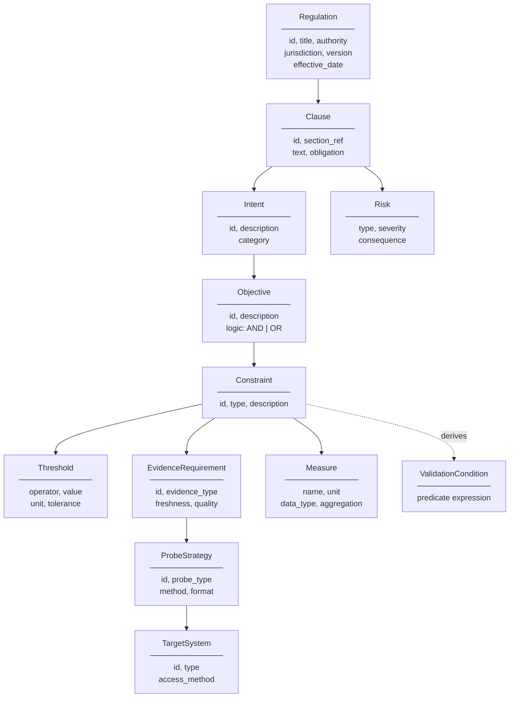
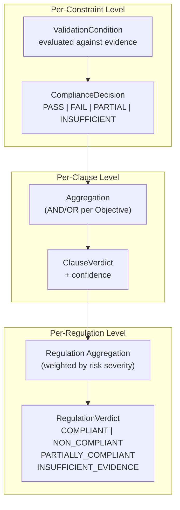

# CCL v1 — Compliance Cognitive Language

## Formal Specification

> **Version**: 1.0-draft  
> **Status**: Design specification  
> **Platform**: CompliAI — Compliance Engineering Digital Twin  
> **Namespace**: `urn:compliai:ccl:v1`

---

## Table of Contents

1. [Philosophy & Design Goals](#1-philosophy--design-goals)
2. [Core Semantic Model](#2-core-semantic-model)
3. [CCL Ontology](#3-ccl-ontology)
4. [Execution Semantics](#4-execution-semantics)
5. [Compliance Validation Semantics](#5-compliance-validation-semantics)
6. [Traceability Semantics](#6-traceability-semantics)
7. [Explainability Semantics](#7-explainability-semantics)
8. [Extensibility Model](#8-extensibility-model)
9. [CCL Object Hierarchy](#9-ccl-object-hierarchy)
10. [Full XML Structure Design](#10-full-xml-structure-design)
11. [Validation Rules](#11-validation-rules)
12. [End-to-End Example](#12-end-to-end-example)
13. [Final Architectural Positioning](#13-final-architectural-positioning)

---

## 1. Philosophy & Design Goals

### 1.1 What Problem CCL Solves

Telecom regulations are written in natural language for human interpretation. Compliance validation systems require machine-executable logic. Between these two worlds lies a semantic gap that cannot be bridged by simple rule extraction.

Consider a regulation clause:

> *"The service provider shall ensure that the average round-trip latency for voice over LTE calls does not exceed 150 milliseconds as measured at the core network boundary, with 95th percentile latency not exceeding 200 milliseconds, measured over any rolling 24-hour window."*

This single sentence contains:

| Dimension | Content |
|-----------|---------|
| **Intent** | Ensure voice call quality |
| **Metric** | Round-trip latency |
| **Thresholds** | avg ≤ 150ms, p95 ≤ 200ms |
| **Scope** | VoLTE calls |
| **Measurement point** | Core network boundary |
| **Aggregation** | Rolling 24-hour window |
| **Obligation type** | Mandatory ("shall") |

No static rule engine captures all of these dimensions simultaneously while preserving their **relationships**, their **intent**, and their **traceability** back to the source text. This is the gap CCL fills.

### 1.2 Why an Intermediate Semantic Layer is Necessary

```
Regulation Text (ambiguous, contextual, legal)
        │
        │  ← Intent extraction (lossy, interpretive)
        ▼
   ╔═══════════╗
   ║    CCL    ║  ← Semantic layer: precise, traceable, executable
   ╚═══════════╝
        │
        │  ← Probe derivation (deterministic)
        ▼
Executable Probes (mechanical, auditable)
```

**Without CCL**, the system must jump directly from ambiguous regulation text to executable validation. This creates three fatal problems:

1. **Loss of intent.** A probe that checks `avg_latency <= 150` has lost the information that this threshold exists to ensure voice call quality. When the probe fails, no one knows *why* the threshold exists — only that it was breached.

2. **Opaque reasoning.** An auditor cannot trace from a compliance verdict back through the reasoning chain to the original regulation clause. The link between "non-compliant" and "TRAI Regulation 2024, Chapter IV, Clause 4.2.1" is lost.

3. **Brittleness.** Hard-coded probes break when regulations change. A semantic layer allows the system to *regenerate* probes from updated CCL without rewriting validation logic.

### 1.3 How CCL Differs from Existing Approaches

| Approach | What it does | What it lacks |
|----------|-------------|---------------|
| **Static rule engine** (e.g., Drools) | Evaluates `IF-THEN` rules against facts | No intent, no traceability, no confidence, no partial compliance |
| **Policy engine** (e.g., OPA/Rego) | Evaluates authorization policies | Designed for access control, not compliance reasoning; no evidence model |
| **Hardcoded validators** | Direct `assert latency < 150` | Zero explainability, zero adaptability, breaks on any regulation change |
| **CCL** | Encodes regulation *meaning* as a structured, executable, traceable semantic document | — |

### 1.4 Three Design Principles

**Intent-driven.** CCL encodes *why* a compliance requirement exists, not just *what* must be checked. Every probe is traceable to an intent, and every intent is traceable to a regulation clause.

**Execution-aware.** CCL is not a passive description. Every CCL element has defined execution semantics — the system knows *how* to validate it, *what evidence* to collect, and *what tools* to use.

**Explainability-native.** CCL does not bolt on explainability after the fact. Every element carries the metadata needed to reconstruct a full reasoning chain from regulation to verdict.

---

## 2. Core Semantic Model

CCL is built from 16 semantic primitives organized into four layers.

### 2.1 Primitive Taxonomy

```
┌─────────────────────────────────────────────────────────────────┐
│                     REGULATION LAYER                            │
│   Regulation · Clause · Obligation                              │
├─────────────────────────────────────────────────────────────────┤
│                      INTENT LAYER                               │
│   Intent · Objective · Constraint · Threshold                   │
├─────────────────────────────────────────────────────────────────┤
│                     EVIDENCE LAYER                              │
│   EvidenceRequirement · ProbeStrategy · TargetSystem · Measure  │
├─────────────────────────────────────────────────────────────────┤
│                    REASONING LAYER                              │
│   ValidationCondition · ComplianceDecision · Justification ·   │
│   Confidence · Lineage                                          │
├─────────────────────────────────────────────────────────────────┤
│                       META LAYER                                │
│   Risk                                                          │
└─────────────────────────────────────────────────────────────────┘
```

### 2.2 Primitive Definitions

#### Regulation Layer

| Primitive | Meaning | Purpose | Interactions |
|-----------|---------|---------|-------------|
| **Regulation** | A regulatory document or instrument from which compliance requirements derive. Carries authority, jurisdiction, version, and effective date. | Root container that anchors all compliance reasoning to a legal source. | Contains one or more `Clause`. Referenced by `Lineage`. |
| **Clause** | A discrete section of a regulation that imposes one or more requirements. Identified by its section number within the source regulation. | Atomic unit of regulatory obligation. Every compliance requirement traces to exactly one clause. | Contains `Intent`, `Obligation`. Parent is `Regulation`. |
| **Obligation** | The *modal force* of a clause: mandatory ("shall"), recommended ("should"), permissive ("may"), or prohibitive ("shall not"). | Determines enforcement severity and compliance interpretation. A mandatory obligation produces a hard verdict; a recommended obligation produces an advisory. | Property of `Clause`. Influences `ComplianceDecision` severity. |

#### Intent Layer

| Primitive | Meaning | Purpose | Interactions |
|-----------|---------|---------|-------------|
| **Intent** | The *purpose* behind a regulation clause — what the regulator is trying to achieve. Expressed as a natural-language goal with structured metadata. | Preserves the "why" across the CCL pipeline. Two clauses with identical thresholds but different intents generate different explainability chains. | Belongs to `Clause`. Contains `Objective`, `Constraint`. Referenced by `Justification`. |
| **Objective** | A measurable outcome that satisfies the intent. An intent may have multiple objectives (conjunctive or disjunctive). | Bridges the gap between abstract intent and concrete measurement. | Belongs to `Intent`. Contains one or more `Constraint`. |
| **Constraint** | A formal condition that must hold for an objective to be met. Constraints are typed: `metric`, `temporal`, `spatial`, `procedural`, `configuration`. | The atomic unit of compliance checking. Every constraint maps to exactly one `ValidationCondition`. | Belongs to `Objective`. Contains `Threshold`. References `Measure`. |
| **Threshold** | A numeric, categorical, or boolean boundary value against which a measurement is compared. Carries operator (`<=`, `>=`, `==`, `in_range`, `not_null`), value, and unit. | Makes constraints evaluable. Without thresholds, constraints are descriptive but not executable. | Property of `Constraint`. Used by `ValidationCondition`. |

#### Evidence Layer

| Primitive | Meaning | Purpose | Interactions |
|-----------|---------|---------|-------------|
| **EvidenceRequirement** | A specification of what evidence must be collected to evaluate a constraint. Describes the type of evidence (metric, config, log, document), its freshness requirements, and its quality criteria. | Tells the evidence collection system *what to look for* without specifying *how to find it*. | Belongs to `Constraint`. Satisfied by one or more `ProbeStrategy`. |
| **ProbeStrategy** | A plan for collecting evidence to satisfy an `EvidenceRequirement`. Describes the probe type, target system, collection method, and expected output format. | Bridges requirements and execution. The Skill Generator agent converts `ProbeStrategy` into runnable probe definitions. | Belongs to `EvidenceRequirement`. References `TargetSystem`. Consumed by `ProbeAgent`. |
| **TargetSystem** | A component of the regulated system that can be probed for evidence. Described by type (network element, config store, log system, documentation repository), access method, and location. | Decouples compliance logic from system topology. The same `Constraint` can apply to different target systems in different deployments. | Referenced by `ProbeStrategy`. |
| **Measure** | A named, typed measurement that a probe produces. Carries unit, data type, aggregation method, and sampling requirements. | Provides type safety for evidence. A `Threshold` that expects milliseconds cannot be compared against a `Measure` that produces bytes. | Referenced by `Constraint`. Produced by `ProbeStrategy`. |

#### Reasoning Layer

| Primitive | Meaning | Purpose | Interactions |
|-----------|---------|---------|-------------|
| **ValidationCondition** | A fully executable condition derived from a `Constraint` + `Threshold` + `Measure`. Expressed as a formal predicate: `measure(avg_rtt_latency) <= threshold(150ms)`. | The point where CCL becomes computable. Validation conditions are deterministic — given evidence, they produce a boolean result. | Derived from `Constraint`. Produces `ComplianceDecision`. |
| **ComplianceDecision** | The result of evaluating a `ValidationCondition` against collected evidence. One of: `PASS`, `FAIL`, `PARTIAL`, `INSUFFICIENT_EVIDENCE`. Carries the evidence reference that produced it. | Atomic verdict unit. Clause-level and regulation-level verdicts are aggregated from individual `ComplianceDecision` results. | Produced by `ValidationCondition`. Aggregated into clause/regulation verdicts. Explained by `Justification`. |
| **Justification** | A structured explanation of *why* a `ComplianceDecision` was reached. Links the decision to its evidence, its constraint, and the original intent. | The primary explainability artifact. Auditors read justifications to understand verdicts. | Belongs to `ComplianceDecision`. References `Intent`, `Constraint`, evidence. |
| **Confidence** | A [0.0, 1.0] score indicating how reliable a `ComplianceDecision` is. Decomposes into factors: evidence quality, measurement completeness, temporal coverage, interpretation certainty. | Distinguishes between "definitely compliant" (0.98) and "probably compliant but some evidence is stale" (0.65). Critical for risk-aware compliance. | Property of `ComplianceDecision`. Factors sourced from evidence quality and agent certainty. Propagated upward through aggregation. |
| **Lineage** | A directed reference chain linking any CCL element to its origin. Every element carries a `lineage` property recording: source element ID, transformation agent, timestamp, and transformation type. | Enables bidirectional traceability: forward (regulation → verdict) and backward (verdict → regulation). | Attached to every CCL element. Forms a DAG across the document. |

#### Meta Layer

| Primitive | Meaning | Purpose | Interactions |
|-----------|---------|---------|-------------|
| **Risk** | An assessment of the consequence of non-compliance for a given clause. Typed: `operational`, `financial`, `legal`, `reputational`, `safety`. Carries severity: `low`, `medium`, `high`, `critical`. | Enables risk-weighted compliance prioritization. A critical safety risk non-compliance is escalated differently than a low operational risk non-compliance. | Attached to `Clause` or `Intent`. Influences `ComplianceDecision` escalation. |

---

## 3. CCL Ontology

### 3.1 Ontology Hierarchy



### 3.2 Relationship Types

CCL uses three relationship types, each with distinct semantics:

| Relationship | Notation | Meaning | Example |
|-------------|----------|---------|---------|
| **Containment** | `→` | Parent owns child. Child cannot exist without parent. Cascade delete. | `Regulation → Clause` |
| **Reference** | `⇢` | Element refers to another element by ID. No ownership. Cross-branch linking. | `Constraint ⇢ Measure` |
| **Derivation** | `⇝` | Element is mechanically derived from another. The derivation is reproducible. | `Constraint ⇝ ValidationCondition` |

### 3.3 ID Strategy

Every CCL element has a globally unique, hierarchical ID:

```
ccl:{regulation_id}:{clause_id}:{element_type}:{sequence}
```

Examples:
```
ccl:trai-qos-2024:4.2.1:intent:001
ccl:trai-qos-2024:4.2.1:constraint:001
ccl:trai-qos-2024:4.2.1:constraint:001:threshold:001
ccl:trai-qos-2024:4.2.1:evidence-req:001
ccl:trai-qos-2024:4.2.1:probe-strategy:001
```

This hierarchical ID scheme enables:
- **Traceability**: Any element can be traced to its regulation and clause by parsing its ID.
- **Scoping**: Queries like "all constraints for clause 4.2.1" are prefix searches.
- **Stability**: IDs are deterministic from the source structure — regenerating CCL from the same regulation produces the same IDs.

### 3.4 Cross-Reference Integrity

CCL enforces referential integrity through typed references:

```xml
<constraint id="ccl:trai-qos-2024:4.2.1:constraint:001">
  <measure-ref ref="ccl:trai-qos-2024:4.2.1:measure:001" />
  <!-- The referenced measure MUST exist in this document -->
</constraint>
```

All references are validated at parse time. A CCL document with dangling references is **structurally invalid**.

---

## 4. Execution Semantics

### 4.1 The Execution Lifecycle

CCL is not merely descriptive. It has a defined execution lifecycle:

```
  ┌───────────────┐
  │   AUTHORED    │  CCL document created (by CCLGenerator agent or human)
  └──────┬────────┘
         ▼
  ┌───────────────┐
  │   VALIDATED   │  Schema + semantic + referential integrity verified
  └──────┬────────┘
         ▼
  ┌───────────────┐
  │   PLANNED     │  ProbeStrategies resolved to executable probe definitions
  └──────┬────────┘
         ▼
  ┌───────────────┐
  │  EXECUTING    │  Probes running, evidence being collected
  └──────┬────────┘
         ▼
  ┌───────────────┐
  │  EVALUATED    │  ValidationConditions evaluated against collected evidence
  └──────┬────────┘
         ▼
  ┌───────────────┐
  │   DECIDED     │  ComplianceDecisions determined, verdicts aggregated
  └──────┬────────┘
         ▼
  ┌───────────────┐
  │   JUSTIFIED   │  Justifications generated, reasoning chains assembled
  └───────────────┘
```

Each lifecycle state is persisted. A CCL document in `EXECUTING` state can be resumed after a system restart.

### 4.2 How CCL Becomes Executable

The transformation from CCL to running probes follows a deterministic derivation chain:

```
Constraint                    → "avg latency ≤ 150ms"
  + Threshold                 → operator: ≤, value: 150, unit: ms
  + Measure                   → name: avg_rtt_latency, aggregation: mean
  + EvidenceRequirement       → type: metric, freshness: 24h
  + ProbeStrategy             → type: log_scan, method: regex_extract
  + TargetSystem              → type: core_network, access: file_system

═══════════════════════════════════════════════════════════════

ProbeDefinition (generated by SkillGenerator):
  {
    "probe_id": "probe-001",
    "derived_from": "ccl:trai-qos-2024:4.2.1:probe-strategy:001",
    "type": "log_scan",
    "target": "/var/log/volte/rtt_metrics.csv",
    "extraction": {"column": "rtt_ms", "filter": {"call_type": "volte"}},
    "aggregation": {"method": "mean", "window": "24h"},
    "expected_output": {"type": "float", "unit": "ms"}
  }
```

The key architectural constraint: **ProbeStrategies describe WHAT to collect. ProbeDefinitions describe HOW to collect it.** The SkillGenerator agent bridges this gap, and the derivation is always traceable via `derived_from`.

### 4.3 Deterministic vs. Semantic Validation

CCL supports two validation modes:

| Mode | When Used | Example |
|------|-----------|---------|
| **Deterministic** | Constraint has a numeric threshold with a defined operator | `avg_latency <= 150ms` — mechanically evaluable |
| **Semantic** | Constraint requires interpretation or judgment | "The provider shall maintain adequate documentation of its QoS monitoring procedures" — requires LLM analysis |

Both modes produce a `ComplianceDecision`, but their `Confidence` profiles differ:

```xml
<!-- Deterministic: high confidence, evidence-dependent -->
<validation-condition type="deterministic">
  <predicate>measure(avg_rtt_latency) &lt;= threshold(150, ms)</predicate>
  <confidence-profile base="0.99" depends-on="evidence_quality" />
</validation-condition>

<!-- Semantic: lower confidence, interpretation-dependent -->
<validation-condition type="semantic">
  <predicate>semantic_match(documentation, "adequate QoS monitoring procedures")</predicate>
  <confidence-profile base="0.70" depends-on="llm_certainty, evidence_quality" />
</validation-condition>
```

### 4.4 Dynamic Probe Generation

Probes are not hard-coded. They are **derived** from CCL at execution time. This means:

1. Updating a regulation produces new CCL → new probes, without code changes.
2. The same CCL applied to different environments generates different probes (different `TargetSystem` bindings).
3. Probes can be regenerated with different strategies (e.g., switch from `log_scan` to `api_query`) by modifying the `ProbeStrategy` without changing the `Constraint`.

---

## 5. Compliance Validation Semantics

### 5.1 Verdict Determination Model



### 5.2 Verdict Definitions

| Verdict | Formal Condition | Meaning |
|---------|-----------------|---------|
| **COMPLIANT** | All mandatory constraints have `ComplianceDecision = PASS` with `confidence ≥ 0.80` | The regulated entity satisfies all requirements with sufficient evidence |
| **NON_COMPLIANT** | At least one mandatory constraint has `ComplianceDecision = FAIL` with `confidence ≥ 0.80` | The regulated entity demonstrably violates a requirement |
| **PARTIALLY_COMPLIANT** | Some mandatory constraints PASS, others FAIL or have insufficient evidence; or confidence is between 0.50 and 0.80 | The compliance picture is mixed — some requirements are met, others are not or cannot be confirmed |
| **INSUFFICIENT_EVIDENCE** | At least one mandatory constraint has `ComplianceDecision = INSUFFICIENT_EVIDENCE` AND no constraint has `FAIL` | Evidence is inadequate to reach a determination — not the same as non-compliance |

### 5.3 Threshold Semantics

Thresholds are not simple comparisons. They carry rich semantics:

```xml
<threshold>
  <operator>lte</operator>          <!-- lte, gte, eq, neq, in_range, not_null, contains -->
  <value>150</value>
  <unit>ms</unit>
  <tolerance>5</tolerance>          <!-- Optional: ±5ms tolerance band -->
  <aggregation>mean</aggregation>   <!-- How evidence samples are aggregated before comparison -->
  <window>PT24H</window>            <!-- ISO 8601 duration: measurement window -->
  <percentile>null</percentile>     <!-- If set, apply to Nth percentile of evidence -->
  <min-samples>100</min-samples>    <!-- Minimum evidence samples for a valid evaluation -->
</threshold>
```

**Min-samples gate**: If a threshold requires 100 samples and only 30 are available, the `ComplianceDecision` is `INSUFFICIENT_EVIDENCE`, not `PASS` or `FAIL`. This prevents verdicts based on statistically insignificant evidence.

### 5.4 Missing Evidence Handling

```
Evidence Available?
    │
    ├─ YES, sufficient quantity + freshness → Evaluate threshold → PASS or FAIL
    │
    ├─ YES, but stale (freshness exceeded) → INSUFFICIENT_EVIDENCE
    │                                         + confidence penalty
    │
    ├─ YES, but below min-samples → INSUFFICIENT_EVIDENCE
    │                                + note: "only N of M required samples"
    │
    └─ NO evidence collected → INSUFFICIENT_EVIDENCE
                                + note: "probe returned no data"
                                + suggest: alternative probe strategies
```

### 5.5 Partial Compliance Scoring

For regulations with multiple clauses, partial compliance is computed as:

```
partial_compliance_score = Σ(clause_weight × clause_pass) / Σ(clause_weight)
```

Where:
- `clause_weight` is derived from `Risk.severity`: critical=4, high=3, medium=2, low=1
- `clause_pass` is: 1.0 for PASS, 0.5 for PARTIAL, 0.0 for FAIL, null for INSUFFICIENT

Clauses with `INSUFFICIENT_EVIDENCE` are excluded from the denominator, and this is explicitly noted in the verdict.

---

## 6. Traceability Semantics

### 6.1 The Traceability Invariant

> **Every compliance verdict must be traceable, through an unbroken chain of typed references, to the exact regulation clause, collected evidence, and reasoning steps that produced it.**

This is not optional. It is a structural property of CCL. A CCL document that cannot support this trace is **semantically invalid**.

### 6.2 Lineage Chains

CCL defines five lineage dimensions:

```
REGULATION LINEAGE
  Regulation → Clause → Intent → Objective → Constraint
  "This constraint exists because of this clause in this regulation."

EVIDENCE LINEAGE
  EvidenceRequirement → ProbeStrategy → ProbeExecution → EvidenceArtifact
  "This evidence was collected by this probe, which was designed to satisfy this requirement."

PROBE LINEAGE
  Constraint → ProbeStrategy → ProbeDefinition → ProbeExecution
  "This probe was generated to evaluate this constraint."

REASONING LINEAGE
  Evidence → ValidationCondition → ComplianceDecision → Justification
  "This decision was reached by applying this condition to this evidence."

VERDICT LINEAGE
  ComplianceDecision(per constraint) → ClauseVerdict → RegulationVerdict
  "This regulation verdict aggregates these clause verdicts, each from these constraint decisions."
```

### 6.3 Bidirectional Tracing

An auditor can trace in either direction:

**Forward trace** (regulation → verdict):
```
"Show me what happened with TRAI Reg 2024, Clause 4.2.1"
  → Intent: Ensure VoLTE latency quality
    → Constraint: avg_rtt ≤ 150ms
      → Evidence collected: 24,681 RTT samples, mean = 142.3ms
        → ValidationCondition: 142.3 ≤ 150 → PASS
          → Verdict: COMPLIANT (confidence: 0.94)
```

**Backward trace** (verdict → regulation):
```
"Why is the system PARTIALLY_COMPLIANT?"
  → Because ClauseVerdict for 4.2.1 is FAIL
    → Because constraint:002 (p95 ≤ 200ms) evaluated to FAIL
      → Because p95 = 214.7ms, measured across 24,681 samples
        → Required by TRAI QoS Regulation 2024, Chapter IV, §4.2.1
          → Intent: "ensure voice call latency does not degrade user experience"
```

### 6.4 Lineage Metadata

Every CCL element carries a `lineage` property:

```xml
<intent id="ccl:trai-qos-2024:4.2.1:intent:001">
  <lineage>
    <origin type="regulation_clause" ref="ccl:trai-qos-2024:4.2.1" />
    <derived-by agent="intent_agent" at="2024-11-15T10:23:41Z" />
    <transformation type="llm_extraction" model="gpt-4" confidence="0.91" />
  </lineage>
  <!-- ... intent content ... -->
</intent>
```

This means every element knows:
- **Where it came from** (`origin`)
- **Who created it** (`derived-by`)
- **How it was created** (`transformation`)
- **How reliable the creation was** (`confidence`)

---

## 7. Explainability Semantics

### 7.1 How Explainability Integrates with CCL

Explainability in CCL is not an afterthought — it is embedded in the structure. Every `ComplianceDecision` carries a `Justification`, and every `Justification` is a structured reasoning chain.

```
Justification
  ├── Natural language explanation (human-readable)
  ├── Evidence references (what data was used)
  ├── Constraint reference (what rule was applied)
  ├── Intent reference (why this rule exists)
  ├── Confidence decomposition (how sure we are)
  └── Gap analysis (what evidence is missing)
```

### 7.2 Reasoning Chain Structure

A reasoning chain for a single `ComplianceDecision`:

```
PREMISE 1: Regulation TRAI-QoS-2024, Clause 4.2.1 requires
           average VoLTE RTT latency ≤ 150ms.
           [ref: ccl:trai-qos-2024:4.2.1:constraint:001]

PREMISE 2: The intent of this requirement is to ensure
           voice call quality for end users.
           [ref: ccl:trai-qos-2024:4.2.1:intent:001]

EVIDENCE:  24,681 RTT latency samples were collected from
           the core network boundary over a 24-hour window
           (2024-11-14 00:00 to 2024-11-14 23:59).
           Mean RTT = 142.3ms.
           [ref: evidence:run-042:probe-001:batch-001]

EVALUATION: 142.3ms ≤ 150ms → PASS
            [ref: ccl:trai-qos-2024:4.2.1:validation:001]

CONFIDENCE: 0.94
            Factors:
            - Evidence freshness: 1.0 (within 24h)
            - Sample size adequacy: 0.99 (24,681 >> 100 required)
            - Measurement reliability: 0.95 (automated core network logs)

CONCLUSION: COMPLIANT for Constraint 001 of Clause 4.2.1.
```

### 7.3 Evidence Contribution Scoring

When a verdict depends on multiple evidence sources, each source receives a **contribution score** indicating how much it influenced the decision:

```xml
<compliance-decision verdict="FAIL" confidence="0.91">
  <evidence-contributions>
    <contribution evidence-ref="evidence:001" weight="0.65"
                  role="primary_measurement"
                  description="RTT log data directly measured the metric" />
    <contribution evidence-ref="evidence:002" weight="0.25"
                  role="corroborating"
                  description="Network config confirms measurement point is correct" />
    <contribution evidence-ref="evidence:003" weight="0.10"
                  role="contextual"
                  description="Vendor documentation confirms RTT calculation method" />
  </evidence-contributions>
</compliance-decision>
```

### 7.4 Confidence Propagation Through CCL

Confidence flows upward through the CCL hierarchy:

```
Constraint-level confidence (per validation condition)
  │
  ├─ Aggregated per Objective (geometric mean of constraint confidences)
  │
  ├─ Aggregated per Intent (minimum of objective confidences — conservative)
  │
  ├─ Aggregated per Clause (weighted by risk severity)
  │
  └─ Aggregated per Regulation (weighted geometric mean of clause confidences)
```

The conservative (minimum-of) aggregation at the Intent level ensures that a single weak evidence link pulls down the confidence of the entire intent, rather than being averaged away.

---

## 8. Extensibility Model

### 8.1 Domain Extension Architecture

CCL v1 defines the **core primitives**. Domain-specific regulations extend CCL through **extension namespaces** without modifying the core schema.

```xml
<!-- Core CCL namespace -->
<ccl:regulation xmlns:ccl="urn:compliai:ccl:v1">
  
  <!-- QoS extension namespace -->
  <ccl:clause xmlns:qos="urn:compliai:ccl:ext:qos:v1">
    <ccl:constraint>
      <!-- Standard CCL constraint -->
      <qos:metric-class>latency</qos:metric-class>
      <qos:network-layer>transport</qos:network-layer>
      <qos:service-type>volte</qos:service-type>
    </ccl:constraint>
  </ccl:clause>

</ccl:regulation>
```

### 8.2 Planned Extension Namespaces

| Extension | Namespace | Domain-Specific Primitives |
|-----------|-----------|---------------------------|
| **QoS** | `urn:compliai:ccl:ext:qos:v1` | `metric-class`, `network-layer`, `service-type`, `measurement-point`, `sla-tier` |
| **Data Protection (DPDP)** | `urn:compliai:ccl:ext:dpdp:v1` | `data-category`, `processing-purpose`, `consent-basis`, `retention-period`, `cross-border-transfer` |
| **Cybersecurity (CERT-In)** | `urn:compliai:ccl:ext:certin:v1` | `incident-type`, `response-timeline`, `reporting-authority`, `affected-systems` |
| **EMF Compliance** | `urn:compliai:ccl:ext:emf:v1` | `frequency-band`, `power-density`, `exposure-zone`, `measurement-protocol` |
| **Lawful Interception** | `urn:compliai:ccl:ext:li:v1` | `interception-type`, `warrant-class`, `target-identifier`, `handover-interface` |

### 8.3 Extension Rules

1. Extensions **add** domain-specific metadata to core primitives. They do not replace or override core semantics.
2. A CCL document is always valid against the core schema, even if extension elements are removed.
3. Extensions must define their own XSD files, imported into the master schema.
4. The execution engine processes core primitives. Extensions are consumed by domain-specific probe strategies and reporting templates.

### 8.4 Reusable Primitive Patterns

Certain patterns recur across regulation domains. CCL defines **abstract constraint templates** that extensions instantiate:

```xml
<!-- Core: Abstract metric constraint pattern -->
<ccl:constraint-template id="metric-threshold-check">
  <ccl:parameters>
    <ccl:param name="metric_name" type="string" />
    <ccl:param name="operator" type="comparison_operator" />
    <ccl:param name="value" type="decimal" />
    <ccl:param name="unit" type="string" />
    <ccl:param name="aggregation" type="aggregation_method" />
    <ccl:param name="window" type="duration" />
  </ccl:parameters>
</ccl:constraint-template>

<!-- QoS extension instantiates the template -->
<ccl:constraint template="metric-threshold-check">
  <ccl:param name="metric_name">avg_rtt_latency</ccl:param>
  <ccl:param name="operator">lte</ccl:param>
  <ccl:param name="value">150</ccl:param>
  <ccl:param name="unit">ms</ccl:param>
  <ccl:param name="aggregation">mean</ccl:param>
  <ccl:param name="window">PT24H</ccl:param>
</ccl:constraint>
```

---

## 9. CCL Object Hierarchy

### 9.1 Formal Hierarchy

```
CCLDocument
│
├── metadata
│   ├── version: "1.0"
│   ├── generated_at: datetime
│   ├── generated_by: agent_name
│   ├── schema_version: "urn:compliai:ccl:v1"
│   └── extensions: [namespace_uri, ...]
│
├── regulation
│   ├── id: hierarchical_id
│   ├── title: string
│   ├── authority: string
│   ├── jurisdiction: string
│   ├── version: string
│   ├── effective_date: date
│   ├── source_url: uri (optional)
│   │
│   └── clause[]
│       ├── id: hierarchical_id
│       ├── section_ref: string
│       ├── text: string (original regulation text)
│       ├── obligation: MANDATORY | RECOMMENDED | PERMISSIVE | PROHIBITIVE
│       │
│       ├── risk
│       │   ├── type: OPERATIONAL | FINANCIAL | LEGAL | REPUTATIONAL | SAFETY
│       │   ├── severity: LOW | MEDIUM | HIGH | CRITICAL
│       │   └── consequence: string
│       │
│       ├── intent[]
│       │   ├── id: hierarchical_id
│       │   ├── description: string
│       │   ├── category: string
│       │   ├── lineage: lineage_record
│       │   │
│       │   └── objective[]
│       │       ├── id: hierarchical_id
│       │       ├── description: string
│       │       ├── logic: AND | OR
│       │       │
│       │       └── constraint[]
│       │           ├── id: hierarchical_id
│       │           ├── type: METRIC | TEMPORAL | SPATIAL | PROCEDURAL | CONFIGURATION
│       │           ├── description: string
│       │           │
│       │           ├── measure
│       │           │   ├── name: string
│       │           │   ├── unit: string
│       │           │   ├── data_type: FLOAT | INTEGER | BOOLEAN | STRING | ENUM
│       │           │   ├── aggregation: MEAN | MEDIAN | P95 | P99 | MAX | MIN | SUM | COUNT
│       │           │   └── sampling: string
│       │           │
│       │           ├── threshold
│       │           │   ├── operator: LTE | GTE | EQ | NEQ | IN_RANGE | NOT_NULL | CONTAINS
│       │           │   ├── value: any
│       │           │   ├── upper_bound: any (for IN_RANGE)
│       │           │   ├── unit: string
│       │           │   ├── tolerance: decimal (optional)
│       │           │   ├── window: duration (ISO 8601)
│       │           │   └── min_samples: integer
│       │           │
│       │           ├── evidence_requirement
│       │           │   ├── id: hierarchical_id
│       │           │   ├── evidence_type: METRIC | CONFIG | LOG | DOCUMENT | API_RESPONSE
│       │           │   ├── freshness: duration
│       │           │   ├── quality_criteria: string
│       │           │   │
│       │           │   └── probe_strategy[]
│       │           │       ├── id: hierarchical_id
│       │           │       ├── probe_type: LOG_SCAN | CONFIG_SCAN | DOC_SCAN | API_QUERY | MANUAL
│       │           │       ├── method: string
│       │           │       ├── output_format: string
│       │           │       │
│       │           │       └── target_system
│       │           │           ├── id: hierarchical_id
│       │           │           ├── type: NETWORK_ELEMENT | CONFIG_STORE | LOG_SYSTEM | DOC_REPO | API
│       │           │           ├── access_method: FILE_SYSTEM | API | DATABASE | MANUAL
│       │           │           └── location: string
│       │           │
│       │           └── validation_condition
│       │               ├── type: DETERMINISTIC | SEMANTIC
│       │               ├── predicate: string (formal expression)
│       │               └── confidence_profile
│       │                   ├── base: decimal
│       │                   └── depends_on: [factor, ...]
│       │
│       └── lineage: lineage_record
│
└── target_systems[]  (shared, referenced by probe strategies)
    ├── id: hierarchical_id
    ├── type: string
    ├── access_method: string
    └── location: string
```

### 9.2 Object Responsibilities

| Object | Responsibility |
|--------|---------------|
| `CCLDocument` | Root container. Owns metadata, regulation, and shared target systems. |
| `Regulation` | Identity and authority of the regulatory source. |
| `Clause` | The unit of obligation. Every compliance check traces to a clause. |
| `Intent` | The purpose behind a clause. Preserves "why" for explainability. |
| `Objective` | A measurable goal. Groups constraints with AND/OR logic. |
| `Constraint` | The atomic compliance check. Contains measure + threshold + evidence path. |
| `Measure` | Type-safe definition of what is measured. |
| `Threshold` | Type-safe definition of the acceptable boundary. |
| `EvidenceRequirement` | What evidence is needed (not how to get it). |
| `ProbeStrategy` | How to get the evidence (not what is needed). |
| `TargetSystem` | Where to probe. Shared across strategies for deduplication. |
| `ValidationCondition` | The executable predicate derived from constraint + measure + threshold. |
| `Risk` | Consequence assessment for prioritization and escalation. |

---

## 10. Full XML Structure Design

### 10.1 Namespace Declaration

```xml
<?xml version="1.0" encoding="UTF-8"?>
<ccl:document
  xmlns:ccl="urn:compliai:ccl:v1"
  xmlns:qos="urn:compliai:ccl:ext:qos:v1"
  xmlns:xsi="http://www.w3.org/2001/XMLSchema-instance"
  xsi:schemaLocation="urn:compliai:ccl:v1 ccl-v1.xsd">

  <!-- Document content -->

</ccl:document>
```

### 10.2 Full XML Structure

```xml
<?xml version="1.0" encoding="UTF-8"?>
<ccl:document xmlns:ccl="urn:compliai:ccl:v1"
              xmlns:qos="urn:compliai:ccl:ext:qos:v1">

  <!-- ═══════════════════════════════════════════════ -->
  <!-- METADATA                                        -->
  <!-- ═══════════════════════════════════════════════ -->
  <ccl:metadata>
    <ccl:version>1.0</ccl:version>
    <ccl:generated-at>2024-11-15T10:23:41Z</ccl:generated-at>
    <ccl:generated-by agent="ccl_generator" model="gpt-4" />
    <ccl:schema-version>urn:compliai:ccl:v1</ccl:schema-version>
    <ccl:extensions>
      <ccl:extension namespace="urn:compliai:ccl:ext:qos:v1" />
    </ccl:extensions>
  </ccl:metadata>

  <!-- ═══════════════════════════════════════════════ -->
  <!-- SHARED TARGET SYSTEMS                           -->
  <!-- (referenced by probe strategies across clauses) -->
  <!-- ═══════════════════════════════════════════════ -->
  <ccl:target-systems>
    <ccl:target-system id="ts:core-network-logs">
      <ccl:type>LOG_SYSTEM</ccl:type>
      <ccl:access-method>FILE_SYSTEM</ccl:access-method>
      <ccl:location>/var/log/volte/rtt_metrics.csv</ccl:location>
      <qos:network-layer>core</qos:network-layer>
    </ccl:target-system>

    <ccl:target-system id="ts:network-config">
      <ccl:type>CONFIG_STORE</ccl:type>
      <ccl:access-method>FILE_SYSTEM</ccl:access-method>
      <ccl:location>/etc/telecom/qos_config.json</ccl:location>
    </ccl:target-system>
  </ccl:target-systems>

  <!-- ═══════════════════════════════════════════════ -->
  <!-- REGULATION                                      -->
  <!-- ═══════════════════════════════════════════════ -->
  <ccl:regulation id="reg:trai-qos-2024">
    <ccl:title>TRAI Quality of Service Regulations, 2024</ccl:title>
    <ccl:authority>Telecom Regulatory Authority of India</ccl:authority>
    <ccl:jurisdiction>India</ccl:jurisdiction>
    <ccl:reg-version>2024.1</ccl:reg-version>
    <ccl:effective-date>2024-07-01</ccl:effective-date>

    <!-- ─────────────────────────────────────────── -->
    <!-- CLAUSE 4.2.1: VoLTE Latency                 -->
    <!-- ─────────────────────────────────────────── -->
    <ccl:clause id="cl:4.2.1" section-ref="Chapter IV, §4.2.1">
      <ccl:text>The service provider shall ensure that the average
        round-trip latency for voice over LTE calls does not exceed
        150 milliseconds as measured at the core network boundary,
        with 95th percentile latency not exceeding 200 milliseconds,
        measured over any rolling 24-hour window.</ccl:text>
      <ccl:obligation>MANDATORY</ccl:obligation>

      <!-- Risk Assessment -->
      <ccl:risk>
        <ccl:risk-type>OPERATIONAL</ccl:risk-type>
        <ccl:severity>HIGH</ccl:severity>
        <ccl:consequence>Degraded voice quality impacting millions
          of VoLTE subscribers; potential regulatory penalty.</ccl:consequence>
      </ccl:risk>

      <!-- Intent -->
      <ccl:intent id="int:4.2.1:001">
        <ccl:description>Ensure voice over LTE call quality remains
          within acceptable latency bounds to prevent perceptible
          voice degradation for end users.</ccl:description>
        <ccl:category>quality_of_service</ccl:category>
        <ccl:lineage>
          <ccl:origin type="regulation_clause" ref="cl:4.2.1" />
          <ccl:derived-by agent="intent_agent" at="2024-11-15T10:23:41Z" />
          <ccl:transformation type="llm_extraction" confidence="0.91" />
        </ccl:lineage>

        <!-- Objective: Meet latency thresholds -->
        <ccl:objective id="obj:4.2.1:001" logic="AND">
          <ccl:description>VoLTE RTT latency must satisfy both
            average and 95th-percentile thresholds.</ccl:description>

          <!-- ── Constraint 1: Average latency ── -->
          <ccl:constraint id="con:4.2.1:001" type="METRIC">
            <ccl:description>Average RTT ≤ 150ms over 24h window</ccl:description>

            <ccl:measure name="rtt_latency_avg">
              <ccl:unit>ms</ccl:unit>
              <ccl:data-type>FLOAT</ccl:data-type>
              <ccl:aggregation>MEAN</ccl:aggregation>
              <qos:metric-class>latency</qos:metric-class>
              <qos:service-type>volte</qos:service-type>
            </ccl:measure>

            <ccl:threshold>
              <ccl:operator>LTE</ccl:operator>
              <ccl:value>150</ccl:value>
              <ccl:unit>ms</ccl:unit>
              <ccl:tolerance>0</ccl:tolerance>
              <ccl:window>PT24H</ccl:window>
              <ccl:min-samples>100</ccl:min-samples>
            </ccl:threshold>

            <ccl:evidence-requirement id="evr:4.2.1:001"
                                      evidence-type="METRIC"
                                      freshness="PT24H">
              <ccl:quality-criteria>Automated collection from core
                network boundary; no manual sampling.</ccl:quality-criteria>

              <ccl:probe-strategy id="ps:4.2.1:001" probe-type="LOG_SCAN">
                <ccl:method>Parse CSV RTT logs, filter VoLTE calls,
                  compute mean over 24h window.</ccl:method>
                <ccl:output-format>{"avg_rtt_ms": float}</ccl:output-format>
                <ccl:target-system-ref ref="ts:core-network-logs" />
              </ccl:probe-strategy>
            </ccl:evidence-requirement>

            <ccl:validation-condition type="DETERMINISTIC">
              <ccl:predicate>
                measure(rtt_latency_avg) &lt;= threshold(150, ms)
              </ccl:predicate>
              <ccl:confidence-profile base="0.99"
                                      depends-on="evidence_quality sample_size" />
            </ccl:validation-condition>
          </ccl:constraint>

          <!-- ── Constraint 2: P95 latency ── -->
          <ccl:constraint id="con:4.2.1:002" type="METRIC">
            <ccl:description>P95 RTT ≤ 200ms over 24h window</ccl:description>

            <ccl:measure name="rtt_latency_p95">
              <ccl:unit>ms</ccl:unit>
              <ccl:data-type>FLOAT</ccl:data-type>
              <ccl:aggregation>P95</ccl:aggregation>
              <qos:metric-class>latency</qos:metric-class>
              <qos:service-type>volte</qos:service-type>
            </ccl:measure>

            <ccl:threshold>
              <ccl:operator>LTE</ccl:operator>
              <ccl:value>200</ccl:value>
              <ccl:unit>ms</ccl:unit>
              <ccl:window>PT24H</ccl:window>
              <ccl:min-samples>100</ccl:min-samples>
            </ccl:threshold>

            <ccl:evidence-requirement id="evr:4.2.1:002"
                                      evidence-type="METRIC"
                                      freshness="PT24H">
              <ccl:probe-strategy id="ps:4.2.1:002" probe-type="LOG_SCAN">
                <ccl:method>Parse CSV RTT logs, filter VoLTE calls,
                  compute 95th percentile over 24h window.</ccl:method>
                <ccl:output-format>{"p95_rtt_ms": float}</ccl:output-format>
                <ccl:target-system-ref ref="ts:core-network-logs" />
              </ccl:probe-strategy>
            </ccl:evidence-requirement>

            <ccl:validation-condition type="DETERMINISTIC">
              <ccl:predicate>
                measure(rtt_latency_p95) &lt;= threshold(200, ms)
              </ccl:predicate>
              <ccl:confidence-profile base="0.99"
                                      depends-on="evidence_quality sample_size" />
            </ccl:validation-condition>
          </ccl:constraint>

        </ccl:objective>
      </ccl:intent>
    </ccl:clause>

  </ccl:regulation>
</ccl:document>
```

### 10.3 Key Attribute Semantics

| Attribute | Where | Meaning |
|-----------|-------|---------|
| `id` | All elements | Globally unique hierarchical identifier |
| `ref` | `*-ref` elements | Cross-reference to another element's `id` |
| `type` | Constraints, evidence, probes | Categorical classifier that determines execution path |
| `logic` | Objectives | `AND` = all constraints must pass; `OR` = at least one must pass |
| `section-ref` | Clauses | The section number in the original regulation document |
| `freshness` | Evidence requirements | Maximum age of evidence for it to be considered valid (ISO 8601) |
| `min-samples` | Thresholds | Minimum evidence data points for a statistically valid evaluation |
| `base` | Confidence profiles | Starting confidence before evidence-quality adjustments |
| `depends-on` | Confidence profiles | Space-separated list of factors that modify confidence |

---

## 11. Validation Rules

A CCL document must pass four levels of validation to be considered valid.

### 11.1 Schema Validation (Structural)

Verified by XSD or equivalent schema checker.

| Rule | Check |
|------|-------|
| SV-001 | Document has exactly one `<ccl:regulation>` |
| SV-002 | Every element has an `id` attribute |
| SV-003 | Every `<ccl:clause>` has `section-ref` and `obligation` |
| SV-004 | Every `<ccl:constraint>` has `type` attribute |
| SV-005 | Every `<ccl:threshold>` has `operator`, `value`, `unit` |
| SV-006 | Every `<ccl:objective>` has `logic` attribute (AND or OR) |
| SV-007 | Every `<ccl:evidence-requirement>` has `evidence-type` and `freshness` |
| SV-008 | Every `<ccl:probe-strategy>` has `probe-type` |
| SV-009 | Every `<ccl:validation-condition>` has `type` (DETERMINISTIC or SEMANTIC) |

### 11.2 Referential Validation (Integrity)

Verified by the CCL parser.

| Rule | Check |
|------|-------|
| RV-001 | Every `<ccl:target-system-ref>` points to an existing `<ccl:target-system>` |
| RV-002 | Every `<ccl:lineage><ccl:origin>` ref points to an existing element |
| RV-003 | No two elements share the same `id` |
| RV-004 | ID hierarchy is consistent (child IDs are prefixed by parent IDs) |

### 11.3 Semantic Validation (Meaning)

Verified by the CCL semantic validator.

| Rule | Check |
|------|-------|
| SEM-001 | Every `MANDATORY` clause has at least one intent with at least one objective |
| SEM-002 | Every objective has at least one constraint |
| SEM-003 | Every constraint has at least one evidence requirement |
| SEM-004 | Every evidence requirement has at least one probe strategy |
| SEM-005 | Threshold unit matches measure unit (ms vs. ms, not ms vs. bytes) |
| SEM-006 | Threshold operator is compatible with measure data type (LTE requires numeric) |
| SEM-007 | Validation condition predicate references the constraint's measure and threshold |
| SEM-008 | Confidence profile base is in [0.0, 1.0] |
| SEM-009 | `min-samples` is a positive integer |
| SEM-010 | `freshness` and `window` are valid ISO 8601 durations |

### 11.4 Execution Validation (Completeness)

Verified before pipeline execution.

| Rule | Check |
|------|-------|
| EV-001 | Every probe strategy's target system is reachable (access method is configured) |
| EV-002 | Every probe type has a registered probe implementation in the probe registry |
| EV-003 | Every `DETERMINISTIC` validation condition has a parseable predicate |
| EV-004 | Every `SEMANTIC` validation condition has an LLM provider configured |

---

## 12. End-to-End Example

### TRAI QoS Latency Compliance — Full Worked Example

#### Step 1: Regulation Text (Input)

```
Source: TRAI Quality of Service Regulations, 2024
Chapter IV, Section 4.2.1

"The service provider shall ensure that the average round-trip latency
for voice over LTE calls does not exceed 150 milliseconds as measured
at the core network boundary, with 95th percentile latency not exceeding
200 milliseconds, measured over any rolling 24-hour window."
```

#### Step 2: Intent Extraction (IntentAgent Output)

```json
{
  "intents": [
    {
      "intent_id": "int:4.2.1:001",
      "clause_reference": "Chapter IV, §4.2.1",
      "description": "Ensure VoLTE call quality by maintaining RTT latency within acceptable bounds",
      "category": "quality_of_service",
      "severity": "high",
      "measurable_criteria": [
        "Average RTT latency ≤ 150ms",
        "95th percentile RTT latency ≤ 200ms"
      ],
      "target_systems": ["core_network_boundary"],
      "evidence_requirements": ["RTT latency metrics from core network logs"],
      "confidence": 0.91
    }
  ]
}
```

#### Step 3: CCL Generation (CCLGeneratorAgent Output)

The full XML from Section 10.2 above. Key structural decisions made by the CCL generator:

- One clause → one intent → one objective (with `logic="AND"`)
- Two constraints (avg and p95) under a single objective, requiring BOTH to pass
- Both constraints share the same target system → single entry in `<ccl:target-systems>`
- Both validation conditions are `DETERMINISTIC` (numeric comparison)

#### Step 4: Probe Derivation (SkillGeneratorAgent Output)

From the CCL, the SkillGenerator derives two probe definitions:

```json
[
  {
    "probe_id": "probe:run-042:001",
    "derived_from": "ps:4.2.1:001",
    "type": "log_scan",
    "config": {
      "file_path": "/var/log/volte/rtt_metrics.csv",
      "columns": ["timestamp", "call_id", "call_type", "rtt_ms"],
      "filter": {"call_type": "volte"},
      "aggregation": {"method": "mean", "column": "rtt_ms"},
      "window": "24h"
    },
    "expected_output_schema": {
      "type": "object",
      "properties": {"avg_rtt_ms": {"type": "number"}}
    }
  },
  {
    "probe_id": "probe:run-042:002",
    "derived_from": "ps:4.2.1:002",
    "type": "log_scan",
    "config": {
      "file_path": "/var/log/volte/rtt_metrics.csv",
      "columns": ["timestamp", "call_id", "call_type", "rtt_ms"],
      "filter": {"call_type": "volte"},
      "aggregation": {"method": "percentile", "column": "rtt_ms", "percentile": 95},
      "window": "24h"
    },
    "expected_output_schema": {
      "type": "object",
      "properties": {"p95_rtt_ms": {"type": "number"}}
    }
  }
]
```

#### Step 5: Evidence Collection (ProbeAgent Output)

The probes execute against simulated latency logs:

```
# Sample from /var/log/volte/rtt_metrics.csv
timestamp,call_id,call_type,rtt_ms
2024-11-14T00:01:12Z,c-00001,volte,138.2
2024-11-14T00:01:15Z,c-00002,volte,145.7
2024-11-14T00:01:18Z,c-00003,volte,151.3
2024-11-14T00:01:22Z,c-00004,data,89.1    ← filtered out (not VoLTE)
2024-11-14T00:01:25Z,c-00005,volte,162.8
...
(24,681 VoLTE records over 24 hours)
```

Probe results:

```json
{
  "probe_results": [
    {
      "probe_id": "probe:run-042:001",
      "evidence_id": "ev:run-042:001",
      "status": "success",
      "data": {"avg_rtt_ms": 142.3},
      "sample_count": 24681,
      "collection_window": {"start": "2024-11-14T00:00:00Z", "end": "2024-11-14T23:59:59Z"},
      "collected_at": "2024-11-15T00:05:12Z"
    },
    {
      "probe_id": "probe:run-042:002",
      "evidence_id": "ev:run-042:002",
      "status": "success",
      "data": {"p95_rtt_ms": 214.7},
      "sample_count": 24681,
      "collection_window": {"start": "2024-11-14T00:00:00Z", "end": "2024-11-14T23:59:59Z"},
      "collected_at": "2024-11-15T00:05:12Z"
    }
  ]
}
```

#### Step 6: Validation (ValidationCondition Evaluation)

```
Constraint 001: measure(rtt_latency_avg) <= threshold(150, ms)
  → 142.3 <= 150 → PASS
  → confidence: 0.97  (base 0.99 × evidence_quality 0.99 × sample_adequacy 0.99)

Constraint 002: measure(rtt_latency_p95) <= threshold(200, ms)
  → 214.7 <= 200 → FAIL
  → confidence: 0.97  (base 0.99 × evidence_quality 0.99 × sample_adequacy 0.99)

Objective 001 (logic=AND): PASS AND FAIL → FAIL

Clause 4.2.1 verdict: NON_COMPLIANT
  partial_score: 0.5  (1 of 2 constraints passed)
  confidence: 0.97
```

#### Step 7: XAI Analysis (XAIAnalyzerAgent Output)

```json
{
  "analysis": {
    "regulation_verdict": "NON_COMPLIANT",
    "confidence": 0.97,
    "partial_compliance_score": 0.50,
    "clause_verdicts": [
      {
        "clause_id": "cl:4.2.1",
        "verdict": "NON_COMPLIANT",
        "passing_constraints": ["con:4.2.1:001"],
        "failing_constraints": ["con:4.2.1:002"],
        "justification": {
          "summary": "Average RTT latency (142.3ms) is within the 150ms threshold, but 95th percentile latency (214.7ms) exceeds the 200ms threshold by 14.7ms (7.35% over limit).",
          "reasoning_chain": [
            "TRAI QoS 2024 §4.2.1 requires avg RTT ≤ 150ms AND p95 RTT ≤ 200ms for VoLTE",
            "24,681 VoLTE call samples were analyzed from core network logs over 24h",
            "Average RTT = 142.3ms → COMPLIANT with 7.7ms margin",
            "P95 RTT = 214.7ms → NON-COMPLIANT, exceeds threshold by 14.7ms",
            "Since the objective requires ALL constraints to pass (AND logic), the clause is NON-COMPLIANT"
          ],
          "evidence_contributions": [
            {"evidence_id": "ev:run-042:001", "weight": 0.40, "role": "primary"},
            {"evidence_id": "ev:run-042:002", "weight": 0.60, "role": "primary"}
          ],
          "gaps": [],
          "recommendations": [
            "Investigate VoLTE call routing for tail-latency spikes",
            "Review core network congestion patterns during peak hours",
            "Consider QoS queue prioritization adjustments"
          ]
        }
      }
    ],
    "confidence_breakdown": {
      "evidence_freshness": 1.0,
      "sample_adequacy": 0.99,
      "measurement_reliability": 0.98,
      "interpretation_certainty": 1.0
    }
  }
}
```

#### Step 8: Compliance Report (DocumentBuilderAgent Output)

```markdown
# CompliAI Compliance Report

## TRAI Quality of Service Regulations, 2024

**Run ID**: run-042
**Date**: 2024-11-15
**Overall Verdict**: ❌ NON-COMPLIANT
**Confidence**: 97%
**Partial Compliance Score**: 50%

---

## Clause 4.2.1 — VoLTE Latency Requirements

**Verdict**: ❌ NON-COMPLIANT
**Regulation Text**: "The service provider shall ensure that the average
round-trip latency for voice over LTE calls does not exceed 150 milliseconds..."

### Constraint Results

| # | Constraint | Threshold | Measured | Result | Margin |
|---|-----------|-----------|----------|--------|--------|
| 1 | Avg RTT Latency | ≤ 150ms | 142.3ms | ✅ PASS | -7.7ms |
| 2 | P95 RTT Latency | ≤ 200ms | 214.7ms | ❌ FAIL | +14.7ms |

### Evidence Summary

- **Source**: Core network RTT logs (`/var/log/volte/rtt_metrics.csv`)
- **Samples**: 24,681 VoLTE calls
- **Window**: 2024-11-14 00:00 — 2024-11-14 23:59 (24h)
- **Collection**: Automated log scan

### Reasoning Chain

1. TRAI QoS 2024 §4.2.1 requires avg RTT ≤ 150ms AND p95 RTT ≤ 200ms
2. 24,681 VoLTE samples analyzed from core network boundary
3. Average RTT = 142.3ms → COMPLIANT (7.7ms below threshold)
4. P95 RTT = 214.7ms → NON-COMPLIANT (14.7ms above threshold)
5. AND logic requires both constraints to pass → **NON-COMPLIANT**

### Recommendations

- Investigate VoLTE call routing for tail-latency spikes
- Review core network congestion patterns during peak hours
- Consider QoS queue prioritization adjustments

---

**Traceability**: This verdict traces to TRAI QoS Regulation 2024,
Chapter IV, §4.2.1, evaluated using evidence ev:run-042:001 and
ev:run-042:002, collected 2024-11-15T00:05:12Z.
```

#### Step 9: Full Traceability Chain (Audit View)

```
TRAI QoS Regulations 2024 (reg:trai-qos-2024)
  └─ Chapter IV, §4.2.1 (cl:4.2.1) [MANDATORY, HIGH risk]
       └─ Intent: Ensure VoLTE latency quality (int:4.2.1:001)
            └─ Objective: Meet latency thresholds (obj:4.2.1:001) [AND]
                 ├─ Constraint: avg RTT ≤ 150ms (con:4.2.1:001)
                 │    ├─ Evidence: ev:run-042:001 (avg_rtt = 142.3ms)
                 │    │    └─ Probe: probe:run-042:001 (log_scan, 24681 samples)
                 │    └─ Verdict: PASS (confidence: 0.97)
                 │
                 └─ Constraint: p95 RTT ≤ 200ms (con:4.2.1:002)
                      ├─ Evidence: ev:run-042:002 (p95_rtt = 214.7ms)
                      │    └─ Probe: probe:run-042:002 (log_scan, 24681 samples)
                      └─ Verdict: FAIL (confidence: 0.97)

  CLAUSE VERDICT: NON_COMPLIANT (1 of 2 constraints failed)
  REGULATION VERDICT: NON_COMPLIANT
```

---

## 13. Final Architectural Positioning

### CCL as the Semantic Heart

CCL occupies a unique and critical position in the CompliAI architecture:

```
          Human World                    Machine World
    ┌─────────────────┐            ┌─────────────────┐
    │   Regulations   │            │     Probes       │
    │   (ambiguous,   │            │     (precise,    │
    │    contextual,  │  ═══CCL══► │     executable,  │
    │    legal)       │            │     auditable)   │
    └─────────────────┘            └─────────────────┘
```

CCL is the **only** layer that exists in both worlds. It is precise enough for machines to execute, and meaningful enough for humans to audit. This dual nature is not a compromise — it is the design goal.

### CCL as a Bridge

Without CCL, the CompliAI pipeline is a black box: regulation goes in, verdict comes out. With CCL, every intermediate step is:

- **Inspectable**: Humans can read CCL and verify that the system understood the regulation correctly.
- **Editable**: Compliance officers can modify CCL (via HITL workflows) to correct misinterpretations before probes execute.
- **Versionable**: When a regulation changes, the old CCL and new CCL can be diffed to understand exactly what changed.
- **Reproducible**: Given the same CCL and the same evidence, the system will always produce the same verdict.

### CCL as a Foundation for Autonomous Compliance

CCL v1 is designed for a 7-agent pipeline with human oversight. But its semantic structure enables a future where:

1. **Regulations are continuously monitored.** A regulatory monitoring agent detects new or amended TRAI regulations and generates updated CCL automatically.
2. **CCL drives continuous validation.** New telemetry data triggers re-evaluation of validation conditions without regenerating CCL.
3. **CCL enables cross-regulation reasoning.** Multiple CCL documents can be loaded into the knowledge graph simultaneously, enabling the system to detect conflicts between regulations or identify clauses that reinforce each other.
4. **CCL supports autonomous probe evolution.** When a probe strategy fails (target system unavailable, format changed), the system can generate alternative probe strategies from the same evidence requirements without human intervention.

CCL is not just a data format. It is the **cognitive representation** of what compliance means — structured enough to execute, rich enough to explain, and flexible enough to evolve.

This is why it is called the Compliance **Cognitive** Language.
