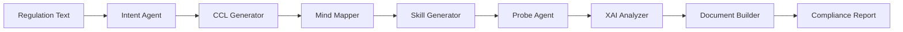

# CompliAI — Compliance Engineering Digital Twin

> Production-grade architecture scaffold for an autonomous multi-agent AI system for telecom regulatory compliance automation.

## Overview

CompliAI converts telecom regulations into executable compliance validation workflows via a 7-agent pipeline:



The V1 prototype targets **TRAI QoS latency compliance** with simulated telecom data.

### Shared SLM + ChromaDB Knowledge Layer

The current implementation adds a centralized SLM/RAG layer so agent reasoning is not isolated per agent. Regulations, standards, audit documents, and supporting telecom references can be parsed and ingested into ChromaDB through `scripts/ingest_regulations.py`. Agents query this shared layer through `infrastructure/slm_service.py`, which wraps the configured LLM provider plus `ChromaVectorStore`.

The intended runtime shape is:

```text
Regulatory / standards documents
  -> DocumentParser
  -> ChromaVectorStore
  -> SLMService
  -> 7-agent compliance pipeline
```

The system should be described as **SLM/RAG-augmented and LLM-guided**, while deterministic engines remain responsible for CCL parsing, probe execution, threshold validation, confidence math, and evidence handling. This keeps regulatory interpretation flexible without allowing nondeterministic model output to directly decide compliance verdicts.

---

## Proposed Repository Structure

```
compliai/
├── backend/                    # FastAPI application
│   ├── app/
│   │   ├── __init__.py
│   │   ├── main.py             # FastAPI entrypoint
│   │   ├── config.py           # Pydantic Settings config
│   │   ├── dependencies.py     # DI container
│   │   ├── middleware/
│   │   │   ├── __init__.py
│   │   │   ├── logging.py
│   │   │   ├── cors.py
│   │   │   └── error_handler.py
│   │   ├── api/
│   │   │   ├── __init__.py
│   │   │   ├── router.py       # Root router
│   │   │   └── v1/
│   │   │       ├── __init__.py
│   │   │       ├── regulations.py
│   │   │       ├── pipelines.py
│   │   │       ├── reports.py
│   │   │       ├── evidence.py
│   │   │       ├── graph.py
│   │   │       ├── telemetry.py
│   │   │       └── health.py
│   │   ├── services/
│   │   │   ├── __init__.py
│   │   │   ├── regulation_service.py
│   │   │   ├── pipeline_service.py
│   │   │   ├── report_service.py
│   │   │   ├── evidence_service.py
│   │   │   └── graph_service.py
│   │   └── repositories/
│   │       ├── __init__.py
│   │       ├── base.py
│   │       ├── regulation_repo.py
│   │       ├── report_repo.py
│   │       └── evidence_repo.py
│   ├── requirements.txt
│   └── pyproject.toml
│
├── agents/                     # The 7 compliance agents
│   ├── __init__.py
│   ├── base.py                 # Abstract base agent
│   ├── registry.py             # Agent registry
│   ├── intent/
│   │   ├── __init__.py
│   │   ├── agent.py
│   │   └── prompts.py
│   ├── ccl_generator/
│   │   ├── __init__.py
│   │   ├── agent.py
│   │   └── prompts.py
│   ├── mind_mapper/
│   │   ├── __init__.py
│   │   ├── agent.py
│   │   └── prompts.py
│   ├── skill_generator/
│   │   ├── __init__.py
│   │   ├── agent.py
│   │   └── prompts.py
│   ├── probe/
│   │   ├── __init__.py
│   │   ├── agent.py
│   │   └── prompts.py
│   ├── xai_analyzer/
│   │   ├── __init__.py
│   │   ├── agent.py
│   │   └── prompts.py
│   └── document_builder/
│       ├── __init__.py
│       ├── agent.py
│       └── prompts.py
│
├── orchestration/              # LangGraph workflow engine
│   ├── __init__.py
│   ├── workflow.py             # Main compliance workflow
│   ├── state.py                # Shared pipeline state
│   ├── nodes.py                # LangGraph node definitions
│   ├── edges.py                # Conditional edge logic
│   └── checkpoints.py         # Human-in-the-loop hooks
│
├── schemas/                    # Pydantic data models
│   ├── __init__.py
│   ├── regulation.py
│   ├── intent.py
│   ├── ccl.py
│   ├── probe.py
│   ├── evidence.py
│   ├── report.py
│   ├── xai.py
│   ├── graph_models.py
│   ├── telemetry.py
│   └── pipeline.py
│
├── ccl/                        # Compliance Cognitive Language
│   ├── __init__.py
│   ├── schema.xsd              # XML Schema Definition
│   ├── parser.py               # CCL XML parser
│   ├── validator.py            # CCL validation
│   ├── builder.py              # CCL XML builder
│   └── samples/
│       └── trai_qos_latency.xml
│
├── graph/                      # Knowledge graph layer
│   ├── __init__.py
│   ├── base.py                 # Abstract graph interface
│   ├── networkx_backend.py     # NetworkX implementation
│   ├── neo4j_backend.py        # Neo4j stub (future)
│   ├── models.py               # Graph node/edge models
│   └── queries.py              # Common graph queries
│
├── probes/                     # Probe execution engine
│   ├── __init__.py
│   ├── base.py                 # Abstract probe interface
│   ├── registry.py             # Probe registry
│   ├── config_probe.py         # Config scanner
│   ├── log_probe.py            # Log analyzer
│   ├── doc_probe.py            # Document analyzer
│   └── runners/
│       ├── __init__.py
│       └── async_runner.py     # Async probe runner
│
├── reports/                    # Report generation
│   ├── __init__.py
│   ├── builder.py              # Report builder
│   ├── templates/
│   │   └── compliance_report.md.j2
│   └── exporters/
│       ├── __init__.py
│       ├── markdown.py
│       └── pdf.py              # Stub
│
├── observability/              # Logging, tracing, metrics
│   ├── __init__.py
│   ├── logger.py               # Structured logging setup
│   ├── langsmith.py            # LangSmith integration
│   ├── metrics.py              # Metrics collector
│   └── tracing.py              # Distributed tracing hooks
│
├── infrastructure/             # Shared infra abstractions
│   ├── __init__.py
│   ├── vector_store.py         # Qdrant abstraction
│   ├── llm_provider.py         # LLM provider abstraction
│   ├── event_bus.py            # In-process event bus
│   └── storage.py              # File/artifact storage
│
├── configs/                    # Environment configs
│   ├── default.yaml
│   ├── development.yaml
│   ├── production.yaml
│   └── .env.example
│
├── tests/                      # Test suite
│   ├── __init__.py
│   ├── conftest.py
│   ├── unit/
│   │   ├── __init__.py
│   │   ├── test_agents.py
│   │   ├── test_ccl.py
│   │   ├── test_schemas.py
│   │   └── test_graph.py
│   ├── integration/
│   │   ├── __init__.py
│   │   ├── test_pipeline.py
│   │   └── test_api.py
│   └── fixtures/
│       ├── sample_regulation.txt
│       ├── sample_config.json
│       └── sample_latency_logs.csv
│
├── frontend/                   # React/Next.js dashboard
│   ├── package.json
│   ├── next.config.js
│   ├── src/
│   │   ├── app/
│   │   │   ├── layout.js
│   │   │   ├── page.js
│   │   │   ├── globals.css
│   │   │   ├── pipeline/
│   │   │   │   └── page.js
│   │   │   ├── reports/
│   │   │   │   └── page.js
│   │   │   └── graph/
│   │   │       └── page.js
│   │   └── components/
│   │       ├── Sidebar.js
│   │       ├── PipelineViewer.js
│   │       ├── ReportViewer.js
│   │       └── GraphViewer.js
│   └── public/
│
├── docker/                     # Docker configuration
│   ├── Dockerfile.backend
│   ├── Dockerfile.frontend
│   └── docker-compose.yml
│
├── .github/
│   └── workflows/
│       └── ci.yml
│
├── pyproject.toml              # Root Python project config
├── README.md
├── Makefile
├── .gitignore
└── .env.example
```

---

## Proposed Changes

### Work Stream 1 — Core Schemas & Data Models

> Pydantic v2 models for all domain entities.

#### [NEW] schemas/__init__.py
- Re-exports all schema models

#### [NEW] schemas/regulation.py
- `RegulationDocument`, `RegulationClause`, `RegulationSource`, `RegulationUploadRequest`

#### [NEW] schemas/intent.py
- `ComplianceIntent`, `IntentExtractionResult`, `IntentSeverity` enum

#### [NEW] schemas/ccl.py
- `CCLDocument`, `CCLClause`, `CCLProbeStrategy`, `CCLEvidence`

#### [NEW] schemas/probe.py
- `ProbeDefinition`, `ProbeResult`, `ProbeType` enum, `ProbeStatus` enum

#### [NEW] schemas/evidence.py
- `EvidenceItem`, `EvidenceCollection`, `EvidenceType` enum, `EvidenceSource`

#### [NEW] schemas/report.py
- `ComplianceReport`, `ComplianceVerdict` enum, `ReportSection`, `ReportMetadata`

#### [NEW] schemas/xai.py
- `XAIAnalysis`, `ContributionFactor`, `ConfidenceScore`, `ComplianceGap`

#### [NEW] schemas/graph_models.py
- `GraphNode`, `GraphEdge`, `GraphNodeType` enum, `ComplianceGraph`

#### [NEW] schemas/telemetry.py
- `TelemetryEvent`, `LatencyRecord`, `TelemetryBatch`

#### [NEW] schemas/pipeline.py
- `PipelineState`, `PipelineStatus` enum, `PipelineRunRequest`, `PipelineRunResult`

---

### Work Stream 2 — Agent Skeletons

> Abstract base class + 7 concrete agent skeletons with prompt templates.

#### [NEW] agents/base.py
- `BaseComplianceAgent` ABC with `async execute()`, `async validate_input()`, `async validate_output()`, observability hooks

#### [NEW] agents/registry.py
- `AgentRegistry` for agent discovery and instantiation

#### [NEW] agents/intent/agent.py
- `IntentAgent(BaseComplianceAgent)` — extracts compliance intent from regulation text

#### [NEW] agents/ccl_generator/agent.py
- `CCLGeneratorAgent(BaseComplianceAgent)` — converts intent JSON to CCL XML

#### [NEW] agents/mind_mapper/agent.py
- `MindMapperAgent(BaseComplianceAgent)` — builds knowledge graph from CCL

#### [NEW] agents/skill_generator/agent.py
- `SkillGeneratorAgent(BaseComplianceAgent)` — creates probe definitions

#### [NEW] agents/probe/agent.py
- `ProbeAgent(BaseComplianceAgent)` — orchestrates probe execution

#### [NEW] agents/xai_analyzer/agent.py
- `XAIAnalyzerAgent(BaseComplianceAgent)` — explainable AI analysis

#### [NEW] agents/document_builder/agent.py
- `DocumentBuilderAgent(BaseComplianceAgent)` — generates compliance reports

Each agent includes a `prompts.py` with system/user prompt templates.

---

### Work Stream 3 — Orchestration (LangGraph)

> LangGraph StateGraph workflow with conditional edges, retries, and human checkpoints.

#### [NEW] orchestration/state.py
- `CompliancePipelineState(TypedDict)` — shared state across all nodes

#### [NEW] orchestration/nodes.py
- Node functions wrapping each agent's execution

#### [NEW] orchestration/edges.py
- Conditional edge logic (branching, retry decisions)

#### [NEW] orchestration/checkpoints.py
- Human-in-the-loop approval gates

#### [NEW] orchestration/workflow.py
- `build_compliance_workflow()` → returns compiled LangGraph `StateGraph`

---

### Work Stream 4 — FastAPI Backend

> Versioned API with service layer, repository pattern, DI, middleware.

#### [NEW] backend/app/main.py
- FastAPI app factory with lifespan, middleware registration

#### [NEW] backend/app/config.py
- `Settings(BaseSettings)` with env-driven config, YAML overrides

#### [NEW] backend/app/dependencies.py
- Dependency injection for services, repos, LLM providers

#### [NEW] backend/app/api/v1/*.py
- REST endpoints: regulations, pipelines, reports, evidence, graph, telemetry, health

#### [NEW] backend/app/services/*.py
- Business logic services with async interfaces

#### [NEW] backend/app/repositories/*.py
- Data access layer with abstract base + in-memory implementations

#### [NEW] backend/app/middleware/*.py
- CORS, structured logging, error handling middleware

---

### Work Stream 5 — CCL + Graph + Probes + Reports

> Domain-specific subsystems.

#### [NEW] ccl/schema.xsd
- XML Schema for CCL v1

#### [NEW] ccl/samples/trai_qos_latency.xml
- Example CCL for TRAI QoS latency regulation

#### [NEW] ccl/parser.py, ccl/validator.py, ccl/builder.py
- CCL processing pipeline

#### [NEW] graph/base.py
- `AbstractGraphBackend` with CRUD + query interface

#### [NEW] graph/networkx_backend.py
- NetworkX implementation of graph backend

#### [NEW] graph/neo4j_backend.py
- Neo4j stub with `NotImplementedError`

#### [NEW] probes/base.py
- `AbstractProbe` ABC

#### [NEW] probes/config_probe.py, probes/log_probe.py, probes/doc_probe.py
- Concrete probe skeletons

#### [NEW] reports/builder.py
- Jinja2-based report builder

#### [NEW] reports/templates/compliance_report.md.j2
- Markdown report template

---

### Work Stream 6 — Infrastructure & Observability

> Cross-cutting concerns: vector store, LLM provider, event bus, logging, tracing.

#### [NEW] infrastructure/vector_store.py
- `AbstractVectorStore` + `ChromaVectorStore` implementation

#### [NEW] infrastructure/llm_provider.py
- `AbstractLLMProvider` + `OpenAILLMProvider` (handles OpenAI, Groq, Ollama)

#### [NEW] infrastructure/slm_service.py
- `SLMService`: A centralized RAG service that wraps both the `LLMProvider` and `ChromaVectorStore`. Exposes a unified `query()` method that automatically retrieves context from the vector store and queries the LLM. All agents will use this service.

#### [NEW] infrastructure/event_bus.py
- In-process async event bus

#### [NEW] infrastructure/storage.py
- File/artifact storage abstraction

#### [NEW] observability/logger.py
- Structured JSON logging with `structlog`

#### [NEW] observability/langsmith.py
- LangSmith tracing hooks

#### [NEW] observability/metrics.py, observability/tracing.py
- Metrics collector and distributed tracing stubs

---

### Work Stream 7 — Docker, Config, CI

> Deployment infrastructure.

#### [NEW] docker/Dockerfile.backend
- Multi-stage Python build

#### [NEW] docker/Dockerfile.frontend
- Multi-stage Node.js build

#### [NEW] docker/docker-compose.yml
- Backend, frontend, Qdrant, Redis services

#### [NEW] configs/default.yaml, configs/development.yaml, configs/production.yaml
- Environment-specific YAML configs

#### [NEW] .env.example, .github/workflows/ci.yml, Makefile, .gitignore
- DevOps scaffolding

---

### Work Stream 8 — Frontend Dashboard

> Next.js App Router skeleton with dark-mode dashboard shell.

#### [NEW] frontend/package.json, frontend/next.config.js
- Next.js 14 project config

#### [NEW] frontend/src/app/layout.js, frontend/src/app/page.js
- Root layout with sidebar navigation, dark theme

#### [NEW] frontend/src/app/globals.css
- Premium dark theme design system

#### [NEW] frontend/src/app/pipeline/page.js
- Pipeline visualization placeholder

#### [NEW] frontend/src/app/reports/page.js
- Compliance report viewer

#### [NEW] frontend/src/app/graph/page.js
- Knowledge graph visualization placeholder

#### [NEW] frontend/src/components/*.js
- Sidebar, PipelineViewer, ReportViewer, GraphViewer components

---

### Work Stream 9 — Tests & Mock Data

#### [NEW] tests/conftest.py
- Shared fixtures, async test setup

#### [NEW] tests/unit/test_agents.py, test_ccl.py, test_schemas.py, test_graph.py
- Unit test skeletons

#### [NEW] tests/integration/test_pipeline.py, test_api.py
- Integration test skeletons

#### [NEW] tests/fixtures/sample_regulation.txt
- TRAI QoS regulation excerpt

#### [NEW] tests/fixtures/sample_config.json
- Simulated telecom config

#### [NEW] tests/fixtures/sample_latency_logs.csv
- Simulated latency log data

---

## Verification Plan

### Automated Tests
- `python -m pytest tests/unit/ -v` — all unit tests pass
- `python -m pytest tests/integration/ -v` — integration tests pass
- Python type checking with `pyright` or `mypy` (optional)
- Docker build verification: `docker-compose build`

### Manual Verification
- Folder structure review
- Import chain verification (no circular imports)
- FastAPI app starts without errors
- Frontend dev server starts

---

## Final Decisions on Architecture

Based on your feedback and the provided `CompliAI (1).docx` architectural document, here are the decisions for the previously open questions:

1. **LLM Provider**: We will proceed with the `OpenAILLMProvider` as a unified interface. It defaults to the best available provider based on your environment variables (OpenAI, Groq, or a local Ollama server). This gives maximum flexibility without needing code changes later.
2. **Centralized SLM RAG Usage**: The document specifies 7 agents. Based on their roles:
   - **Intent (Agent 1), CCL (Agent 2), XAI Analyzer (Agent 6), Document Builder (Agent 7)** heavily require the SLM. We will wire them to use the centralized `SLMService` with RAG.
   - **Skill Generator (Agent 4)** will also use the SLM to map complex CCL strategies to specific network probes.
   - **Mind Mapper (Agent 3) & Probe (Agent 5)** are primarily deterministic (parsing XML and executing code). We will provide them access to the SLM in case semantic code analysis is needed, but their core logic will remain deterministic for reliability.
3. **Database**: *Elaboration:* Right now, the system holds all data (like the generated XML, compliance reports, and probe results) in memory. When the script finishes, the data is lost. By adding a database (we'll use `SQLite` since it requires no extra servers), we can permanently save the results of every compliance run. This means your future dashboard will be able to show a history of all past audits.
4. **Frontend Framework**: Skipped for now. We will focus purely on the backend, API, and the Agent Pipeline.
5. **Authentication**: We will implement JWT (JSON Web Token) based authentication for the FastAPI backend. Any user or external system trying to trigger the pipeline via API will need to provide a valid token.
